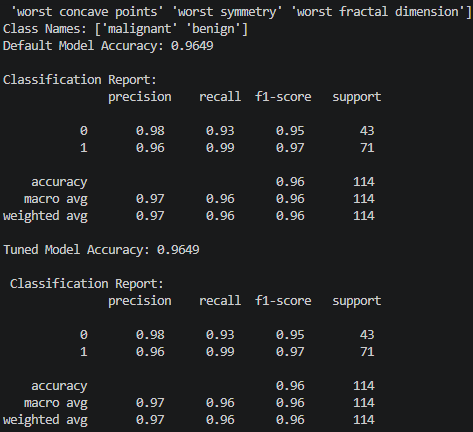
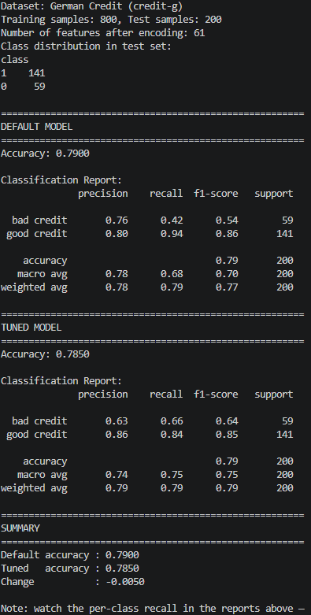
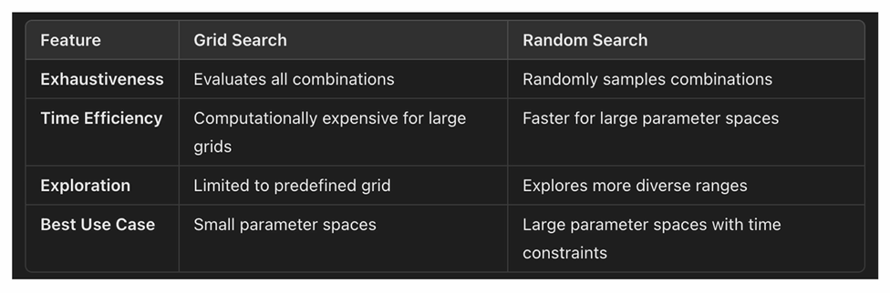
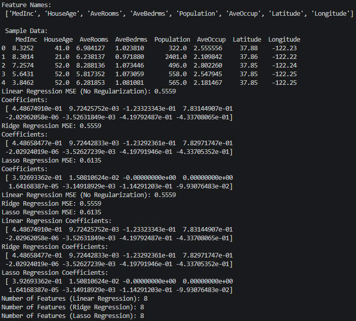
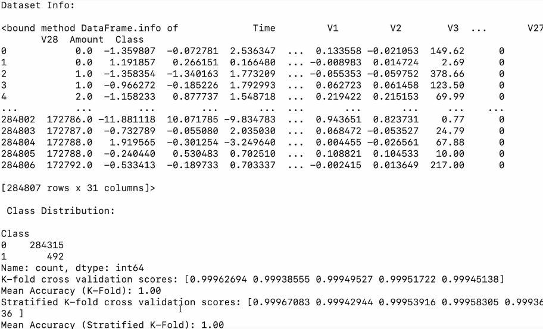
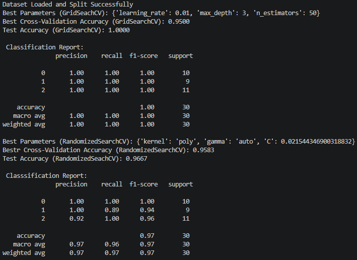
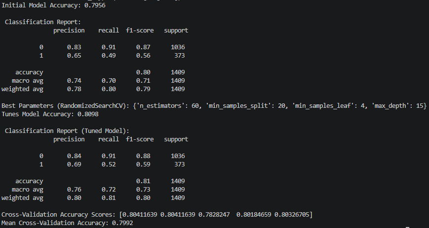

# Section 2 Model Tuning and Optimiztion Notes

## Content
3.  [Day 1: Introduction to Hyperparameter Tuning](#3-day-1-introduction-to-hyperparameter-tuning)
4.  [Day 2: Grid Search and Random Search](#4-day-2-grid-search-and-random-search)
5.  [Day 3: Advanced Hyperparameter Tuning with Bayesian Optimization](#5-day-3-advanced-hyperparameter-tuning-with-bayesian-optimization)
6.  [Day 4: Regularization Techniques for Model Optimization](#6-day-4-regularization-techniques-for-model-optimization)
7.  [Day 5: Cross-Validation and Model Evaluation Techniques](#7-day-5-cross-validation-and-model-evaluation-techniques)
8.  [Day 6: Automated Hyperparameter Tuning with GridSearchCV and RandomizedSearchCV](#8-day-6-automated-hyperparameter-tuning-with-gridsearchcv-and-randomizedsearchcv)
9.  [Day 7: Optimization Project – Building and Tuning a Final Model](#9-day-7-optimization-project--building-and-tuning-a-final-model)


## 3. Day 1: Introduction to Hyperparameter Tuning

[⬆ Back to content](#content)

### Difference between parameters and hyperparameters:

- Parameters are values learned by a machine learning model during training.
    - They are adjusted to minimize the loss function and optimize predictions
    - Examples:
      - Coefficients in linear regression
      - The weights and biases in neural networks

- Hyperparameters are setting defined before training that influence how the model learns from data.
    - They are not learned from the data, but instead control the training process.
    - Examples:
      - Tree depth - Maximum depth of decision trees
      - Learning rate - step size for gradient descent 
      - Number of estimators
      - Number of trees in an ensemble model.


### Importance of tuning hyperparameters.

Now why tune hyperparameters? - 
  - Improves the model performance
    - Hyperparameters that help models generalize better, reducing overfitting and underfitting 
  - Enhance efficiency
    - Proper tuning can reduce training time and computational resources 
  - Adapt to problem specific needs
    - Tailoring hyperparameters ensures the model fits the datasets characteristics. 

Common hyperparameters in popular models
  - Decision trees and Random Forest
    - Max Depth: Limits the depth of trees to avoid overfitting.
    - Min Samples Split: Minimum samples required to split an internal node
    - Number of Estimators: Total number of trees in a Random Forest
  
  - Gradient boosting models (XGBoost and Lightgbm)
    - Learning Rate: Determines the contribution of each tree
    - Subsample: Fraction of training data used to train each tree
    - Max Depth: Limits the complexity of individual trees

  - Neural Networks
    - Learning Rate: The step size for weight updates
    - Number of layers: Determines the depth of the network
    - Batch Size: Number of samples per gradient update

### Hand-on Exercise

We will jump into a quick hands on exercise where the objective is to train a model with default hyperparameters, evaluate its performance, and manually adjust a few hyperparameters to observe their impact on results.

The data set we'll be using here is iris data set, which is an optimal data set already. We'll use it because it's a multi-class classification problem and it will be a good sample to walk through. We will not be seeing the impact on the results with hyperparameter tuning because it's always optimal. It gives us an idea or a guide on how to approach this problem.


day1_ex.py 

```python
# import libraries
from sklearn.datasets import load_breast_cancer
## Splits data into training and testing sets
from sklearn.model_selection import train_test_split
## Data manipulation library allowing you to load and manipulate data in a structured DataFrame format
import pandas as pd
## random forest classifier - used for human activity recognization
from sklearn.ensemble import RandomForestClassifier
# Metrics to evaluate the model's performance
## Accuracy score which calculates how often the model's predictions are correct
## Classification report which provides precision, recall, and F1-score for each class
from sklearn.metrics import  accuracy_score, classification_report


# Load dataset
data = load_breast_cancer()
X, y = data.data, data.target

# Split dataset
## X is our feature set, y is our target which is spam
## Test size is out of all the data that we have, we want 20% of the data to be test, whereas 80% of the data to be used as a training data
## Setting a random state ensures reproducibility
## This will give us variables - training data, testing data, training targets and testing targets
X_train, X_test, y_train, y_test = train_test_split(X, y, test_size=0.2, random_state=42)

# Display dataset info
print(f"Feature Names: {data.feature_names}")
print(f"Class Names: {data.target_names}")

# Train Random Forest with default hyperparameters
rf_default = RandomForestClassifier(random_state=42)
rf_default.fit(X_train, y_train)

# Predict and evaluate
y_predict_default = rf_default.predict(X_test)
accuracy_default = accuracy_score(y_test, y_predict_default)

print(f"Default Model Accuracy: {accuracy_default:.4f}")
print("\nClassification Report:\n", classification_report(y_test, y_predict_default))

# Train Random Forest with adjusted hyperparameters
## Modify some key hyperparameters such as n estimators and maxdepth to observe their impact on the model performance
rf_tuned = RandomForestClassifier(
    n_estimators=400,                   # giving the maximum is better
    max_depth=5,                        # limit of the tree depth
    random_state=42                     # generates the same data every time we run it
)
rf_tuned.fit(X_train, y_train)

# Predict and evaluate
y_pred_tuned = rf_tuned.predict(X_test)
accuracy_tuned = accuracy_score(y_test, y_pred_tuned)

## Compare those results
print(f"Tuned Model Accuracy: {accuracy_tuned:.4f}")
print("\n Classification Report:\n", classification_report(y_test, y_pred_tuned))

```
Run the file        
    terminal --> python day1_ex.py      

Results:


<br>
<br>

We trained models with default and manually tune the hyperparameters and we learned how hyperparameter adjustment might influence key metrics like accuracy and classification report. In our case, we did not see that but it does if we use different datasets.

We have second example for different model dataset that results in more visible changes after the parameter tuning.

day1_ex_2.py 

```python
# import libraries
from sklearn.datasets import fetch_openml
# Splits data into training and testing sets
from sklearn.model_selection import train_test_split
# Data manipulation library for structured DataFrame format
import pandas as pd
# Random Forest classifier - ensemble model using multiple decision trees
from sklearn.ensemble import RandomForestClassifier
# Metrics to evaluate the model's performance:
# - accuracy_score: overall percentage of correct predictions
# - classification_report: per-class precision, recall, and F1-score
from sklearn.metrics import accuracy_score, classification_report


# Load dataset
# Credit-g (German Credit) is a binary classification dataset with 1,000 samples
# and 20 features. It predicts whether a loan applicant is a good or bad credit risk.
# Its overlapping classes and mix of noisy/informative features make it sensitive
# to hyperparameter choices — unlike simple datasets where defaults already excel.
credit = fetch_openml('credit-g', version=1, as_frame=True)
X = pd.get_dummies(credit.data)   # encode categorical features as numeric columns
y = (credit.target == 'good').astype(int)  # convert target to binary: 1 = good, 0 = bad

# Split dataset
# 80% of the data is used for training, 20% for testing.
# random_state=42 ensures the same split every time the script is run (reproducibility).
X_train, X_test, y_train, y_test = train_test_split(
    X, y, test_size=0.2, random_state=42
)

# Display dataset info
print(f"Dataset: German Credit (credit-g)")
print(f"Training samples: {X_train.shape[0]}, Test samples: {X_test.shape[0]}")
print(f"Number of features after encoding: {X_train.shape[1]}")
print(f"Class distribution in test set:\n{y_test.value_counts().to_string()}\n")

# ─────────────────────────────────────────────────────────────────────────────
# DEFAULT MODEL
# Scikit-learn defaults: n_estimators=100, max_depth=None (grows full trees),
# min_samples_split=2, max_features='sqrt', class_weight=None.
# Full-depth trees tend to overfit on noisy datasets like this one,
# and ignoring class imbalance hurts recall on the minority class (bad credit).
# ─────────────────────────────────────────────────────────────────────────────
rf_default = RandomForestClassifier(random_state=42)
rf_default.fit(X_train, y_train)

y_pred_default = rf_default.predict(X_test)
accuracy_default = accuracy_score(y_test, y_pred_default)

print("=" * 55)
print("DEFAULT MODEL")
print("=" * 55)
print(f"Accuracy: {accuracy_default:.4f}")
print("\nClassification Report:")
print(classification_report(y_test, y_pred_default, target_names=["bad credit", "good credit"]))

# ─────────────────────────────────────────────────────────────────────────────
# TUNED MODEL
# Key changes and their reasoning:
#
#   n_estimators=200    – more trees reduce variance without major cost;
#                         100 (default) is sometimes too few for noisy data.
#
#   max_depth=8         – caps tree depth to prevent overfitting on noise;
#                         None (default) allows trees to memorise training data.
#
#   min_samples_split=10 – requires more evidence before splitting a node,
#                          which smooths decision boundaries.
#
#   min_samples_leaf=4  – each leaf must cover at least 4 samples,
#                         further reducing overfitting on edge cases.
#
#   max_features=0.6    – each split considers 60% of features instead of
#                         sqrt (≈37%), adding more diversity between trees.
#
#   class_weight='balanced' – adjusts weights inversely proportional to class
#                             frequency, improving recall on the minority class
#                             (bad credit applicants are harder to detect).
# ─────────────────────────────────────────────────────────────────────────────
rf_tuned = RandomForestClassifier(
    n_estimators=200,
    max_depth=8,
    min_samples_split=10,
    min_samples_leaf=4,
    max_features=0.6,
    class_weight='balanced',
    random_state=42
)
rf_tuned.fit(X_train, y_train)

y_pred_tuned = rf_tuned.predict(X_test)
accuracy_tuned = accuracy_score(y_test, y_pred_tuned)

print("=" * 55)
print("TUNED MODEL")
print("=" * 55)
print(f"Accuracy: {accuracy_tuned:.4f}")
print("\nClassification Report:")
print(classification_report(y_test, y_pred_tuned, target_names=["bad credit", "good credit"]))

# ─────────────────────────────────────────────────────────────────────────────
# SUMMARY
# The tuned model trades a small drop in raw accuracy for better recall on
# bad-credit cases — a more realistic goal in credit risk applications where
# missing a bad applicant is costly.
# ─────────────────────────────────────────────────────────────────────────────
print("=" * 55)
print("SUMMARY")
print("=" * 55)
print(f"Default accuracy : {accuracy_default:.4f}")
print(f"Tuned   accuracy : {accuracy_tuned:.4f}")
print(f"Change           : {accuracy_tuned - accuracy_default:+.4f}")
print("\nNote: watch the per-class recall in the reports above —")
print("the tuned model improves detection of bad-credit applicants.")
```

Run the file        
    terminal --> python day1_ex_2.py  

Results:


<br>
<br>

[⬆ Back to content](#content)


## 4. Day 2: Grid Search and Random Search

[⬆ Back to content](#content)

Introduction to Grid Search and Random Search
- What is grid search?
  - Grid search is a method of hyperparameter tuning that systematically evaluates all possible combinations of hyperparameter values within a specified grid.
  - How does it work?
    - Define a range of values for each hyperparameter
    - Train and evaluate the model on each combination of hyperparameter values
    - Select the combination that yields the best performance

- What is random search?
  - Random search is an alternative method where hyperparameter combinations are sampled randomly from the specified ranges.
  - Now how does it work?
    - Define ranges or distributions for each hyperparameter
    - Randomly sample a specified number of combinations
    - Train and evaluate the model for each sampled combination

Pros and Cons of each method:


<br>
<br>

Exhaustiveness in Grid Search evaluates all combinations and in Random Search randomly samples combination 
Time Efficiency Grid search is computationally expensive for large grids, whereas Random Search is faster for large parameter spaces.
Exploration - Grid Search is limited to predefined grid where as Random Search explores more diverse ranges.
The best use case for grid search is small parameter spaces, whereas for random search it's large parameter spaces with time constraints parameter spaces.

Practical guideline on choosing the search ranges:
- Start with a broad range
  - Use Random Search to explore large parameter spaces and identify promising ranges
- Refine with grid search
  - Narrow the search space based on random search results and perform exhaustive grid search for fine-tuning
- Understand the model sensitivity
  - Some hyperparameters (example: Learning Rate) require fine granularity, while others (example: number of trees) can have coarser steps.


### Hand-on Exercise

We will do hands-on exercise where objective: 
  - Implement both grid search and random search for hyperparameter tuning. Compare their efficiency and analyze the impact on model performance.
  
The data set will be the iris dataset which is the multi-class classification problem.

day2_ex.py

```python
from sklearn.datasets import load_iris
## Splits data into training and testing sets
from sklearn.model_selection import train_test_split, GridSearchCV, RandomizedSearchCV
## random forest classifier - ensemble method for classification
from sklearn.ensemble import RandomForestClassifier
# Imports performance metrics to evaluate the model's performance
## Accuracy score which calculates how often the model's predictions are correct
from sklearn.metrics import accuracy_score
## matrix operation and mathematical function
import numpy as np

# Load dataset
data = load_iris()
## X are the features and y is the target
X, y = data.data, data.target

# Split Dataset
## X is our feature set, y is our target which is spam
## Test size is out of all the data that we have, we want 20% of the data to be test, whereas 80% of the data to be used as a training data
## Setting a random state ensures reproducibility
## This will give us variables - training data, testing data, training targets and testing targets
X_train, X_test, y_train, y_test = train_test_split(X, y, test_size=0.2, random_state=42)

# Display dataset info
print(f"Feature Names: {data.feature_names}")
print(f"Class Names: {data.target_names}")

## Define a grid of hyperparameters for random forest model and perform exhaustive search using the grid search CV
# Define hyperparameter grid
param_grid = {
    'n_estimators': [50, 100, 150],
    'max_depth': [None, 5, 10],
    'min_samples_split': [2, 5, 10]
}

# Initialize Grid Search
grid_search = GridSearchCV(
    estimator=RandomForestClassifier(random_state=42),
    param_grid=param_grid,
    cv=5,                       # ross validation
    scoring='accuracy',
    n_jobs=-1                   # use all the processors on the PC
)

# Perform Grid Search
grid_search.fit(X_train, y_train)

# Evaluate best model
best_grid_model = grid_search.best_estimator_
y_pred_grid = best_grid_model.predict(X_test)
accuracy_grid = accuracy_score(y_test, y_pred_grid)

print(f"Best Hyperparameters (Grid Search): {grid_search.best_params_}")
print(f"Grid Search Accuracy: {accuracy_grid:.4f}")


## Implement a random search
## Define a parameter distribution for random search and evaluate its performance using the Randomizedsearchcv.

# Define hyperparameter distribution
param_dist = {
    'n_estimators': np.arange(50, 200, 10),
    'max_depth': [None, 5, 10, 15],
    'min_samples_split': [2, 5, 10, 20]
}

# Initialize Random Search
random_search = RandomizedSearchCV(
    estimator=RandomForestClassifier(random_state=42),
    param_distributions=param_dist,
    n_iter=20,                        # number of random combinations to try
    cv=5,                             # ross validation
    scoring='accuracy',
    n_jobs=-1,                        # use all the processors on the PC
    random_state=42
)

# Perform Random Search
# That will create our random search
random_search.fit(X_train, y_train)

# Evaluate best model
best_random_model = random_search.best_estimator_
y_pred_random = best_random_model.predict(X_test)
accuracy_random = accuracy_score(y_test, y_pred_random)

print(f"Best Hyperparameters (Random Search): {random_search.best_params_}")
print(f"Random Search Accuracy: {accuracy_random:.4f}")
```

Run the task    
    terminal --> python day2_ex.py

Result:

Feature Names: ['sepal length (cm)', 'sepal width (cm)', 'petal length (cm)', 'petal width (cm)']   
Class Names: ['setosa' 'versicolor' 'virginica']    
Best Hyperparameters (Grid Search): {'max_depth': None, 'min_samples_split': 2, 'n_estimators': 150}    
Grid Search Accuracy: 1.0000    
Best Hyperparameters (Random Search): {'n_estimators': 140, 'min_samples_split': 5, 'max_depth': None}    
Random Search Accuracy: 1.0000    

Grid search and random search accuracy, both is 1.0, so it's 100%. So that's good.

If you have a real data set with your own numbers and all skewed numbers in there it will be best to test it out the grid search accuracy and random search accuracy.

[⬆ Back to content](#content)


## 5. Day 3: Advanced Hyperparameter Tuning with Bayesian Optimization

[⬆ Back to content](#content)

Introduction to Bayesian Optimization

**What is Bayesian Optimization?**
  - Advanced method for hyperparameter tuning that balances exploration (searching new regions) and exploitation (refining promising regions)
  - Uses a probabilistic model to guide the search for optimal hyperparameters.
  - How it Works:
    - Has a Surrogate model - Builds a probabilistic model (e.g. Gaussian Process) of the objective function based on prior evaluations
    - Acquisition Function - it balances exploration and exploitation by choosing the next hyperparameters to evaluate based on predicted performance and uncertainty.
    - Iterative Refinement - Updates the surrogate model after each evaluation, refining the search
  - Why use Bayesian Optimization?
    - Efficient for high-dimensional and expensive-to-evaluate functions
    - Reduces the number of evaluations required to find near-optimal hyperparameters

**Using Libraries for Bayesian Optimization**
Popular Libraries
  - Hyperopt 
    - Simplifies Bayesian Optimization for hyperparameter tuning
    - Works with 'fmin' to optimize objective functions over a parameter space
  -  Optuna
     - Flexible and user-friendly library for hyperparameter optimization
     - Support dynamic search spaces and pruning of unpromising trails
  
**Understanding Exploration vs. Exploitation**
Exploration 
  - Focuses on sampling hyperparameters from unexplored regions
  - Useful for identifying new areas of high potential
  
Exploitation 
  - Ficuses on refining the search around regions with known high performance
  - Useful for fine-tuning near-optimal hyperparameters

Bayesian Optimization's Advantage
  - Balances this approaches using the acquisition to minimize unnecessary evaluations while improving results. That is why it is standing better than the Grid Search and Random Search

**Hand-On Exercise**

Objective: Apply Bayesian Optimization using Optuna to tune an XGBoost model and compare the results with Grid Search and Random Search

day3_ex.py

```python
# Import libraries
## pip install optuna xgboost sklearn
# Dataset
from sklearn.datasets import load_breast_cancer
## Splits data into training and testing sets
from sklearn.model_selection import train_test_split, GridSearchCV, RandomizedSearchCV
## This scales features to have a mean of zero and standard deviation of one helping improve model stability.
from sklearn.preprocessing import StandardScaler
## Xgboost classifier
from xgboost import XGBClassifier
# Imports performance metrics to evaluate the model's performance
## Accuracy score which calculates how often the model's predictions are correct
from sklearn.metrics import accuracy_score
## Flexible and user-friendly library for hyperparameter optimization
## Support dynamic search spaces and pruning of unpromising trails
import optuna


# Load the dataset
data = load_breast_cancer()
## Set features (X) and target (y)
X, y = data.data, data.target

## Split the data set into training and testing
## X and y are features and my target
## test_size=0.2 mean that 20% of the data size will be used for testing and 80% of the data will be used as a training data
## random_state=42 - key used to make sure that the split is always the same, no matter how many times how we split it
## This will give us variables - training data, testing data, training targets and testing targets
X_train, X_test, y_train, y_test = train_test_split(X, y, test_size=0.2, random_state=42)

# Standardize features
scaler = StandardScaler()
## Fit the scaler to the training data
X_train = scaler.fit_transform(X_train)
## Apply the scaler to the test data
X_test = scaler.transform(X_test)

print(f"Training data shape: {X_train.shape}")
print(f"Test data shape: {X_test.shape}")

# Train a baseline XGBoost model
## Initialuze the model
baseline_model = XGBClassifier(eval_metric='logloss', random_state=42)
## Train the model
baseline_model.fit(X_train, y_train)

# Evaluate the model
## Predict on the test data
baseline_preds = baseline_model.predict(X_test)
## Calculate accuracy
baseline_accuracy = accuracy_score(y_test, baseline_preds)
## Print accuracy
print(f"Baseline XGBoost Accuracy: {baseline_accuracy:.4f}")

# Define the objective function for Optuna
def objective(trial):
    params = {
        ## number of trees
        'n_estimators': trial.suggest_int('n_estimators', 50, 500),
        ## tree depth
        'max_depth': trial.suggest_int('max_depth', 3, 100),
        ## learning rate
        'learning_rate': trial.suggest_float('learning_rate', 0.01, 0.3),
        ## subsample
        'subsample': trial.suggest_float('subsample', 0.6, 1.0),
        ## colsample by tree
        'colsample_bytree': trial.suggest_float('colsample_bytree', 0.6, 1.0),
        ## gamma parameter
        'gamma': trial.suggest_float('gamma', 0, 5),
        ## L1 regularization - Lasso regression penalty parameter - controls the amount of shrinkage applied to the model
        'reg_alpha': trial.suggest_float('reg_alpha', 0, 10),
        ## L2 regularization - Ridge regression penalty parameter - controls the amount of shrinkage applied to the model
        'reg_lambda': trial.suggest_float('reg_lambda', 0, 10)
    }
    
    # Train XGBoost model with suggested params
    ## Initialize the model
    model = XGBClassifier(eval_metric='logloss', random_state=42, **params)
    ## Train the model
    model.fit(X_train, y_train)
    
    # Evaluate model on validation set
    ## Predict on the test data
    preds = model.predict(X_test)
    ## Calculate accuracy
    accuracy = accuracy_score(y_test, preds)
    
    # Return accuracy
    return accuracy

# Create an Optuna study
## Optimize the objective function
study = optuna.create_study(direction="maximize")
## Run the optimization
study.optimize(objective, n_trials=50)

# Best hyperparameters
print("Best Hyperparameters:", study.best_params)
print("Best Accuracy: ", study.best_value)

# Define parameter grid
## Initialize parameter grid
param_grid = {
    ## Number of trees in the ensemble - controls the complexity of the model
    'n_estimators': [100, 200, 300],
    ## Depth of each tree - controls the complexity of the model
    'max_depth': [3, 5, 7],
    ## Learning rate - controls the amount of shrinkage applied to the model
    'learning_rate': [0.01, 0.1, 0.2],
    ## Subsample ratio of training instances - controls the amount of data used for training each tree
    'subsample': [0.6, 0.8, 1.0]
}

# Train XGBoost with Grid Search
## Initialize Grid Search
grid_search = GridSearchCV(
    estimator=XGBClassifier(eval_metric='logloss',random_state=42),
    param_grid=param_grid,
    scoring='accuracy',
    cv=3,
    verbose=1
)
# Train Grid Search
grid_search.fit(X_train, y_train)

# Best parameters and accuracy
print("\n\n\nGrid Search Best Parameters: ", grid_search.best_params_)
print("Grid Search Best Accuracy:", grid_search.best_score_)

# Define parameter distributions
param_dist = {
    'n_estimators': [50,100,200,300,400],               # Number of trees
    'max_depth': [3, 5, 7, 9],                          # Depth of each tree
    'learning_rate': [0.01, 0.05, 0.1, 0.2],            # Learning rate
    'subsample': [0.6, 0.7, 0.8, 0.9, 1.0],             # Subsample ratio
    'colsample_bytree': [0.6, 0.7, 0.8, 0.9, 1.0]       # Feature subsample ratio
}

# Train XGBoost with Random Search
## Initialize Random Search
random_search = RandomizedSearchCV(
    estimator=XGBClassifier(eval_metric='logloss', random_state=42),
    param_distributions=param_dist,
    n_iter=50,                          # Number of random combinations
    scoring='accuracy',                 # Scoring metric
    cv=3,                               # Cross-validation
    verbose=1,                          # Verbosity
    random_state=42                     # Random seed 
)

## Train Random Search
random_search.fit(X_train, y_train)

# Best parameters and accuracy
print("\n\n\nRandom Search Best Parameters:", random_search.best_params_)
print("Random Search Best Accuracy:", random_search.best_score_)

```

Run the file    
    terminal --> day3_ex.py

Result:

Baseline XGBoost Accuracy: 0.9561
Optuna Best Accuracy:  0.9649122807017544
Grid Search Best Accuracy: 0.9757900546067155
Random Search Best Accuracy: 0.9758045776693388


[⬆ Back to content](#content)


## 6. Day 4: Regularization Techniques for Model Optimization

[⬆ Back to content](#content)

**Understanding Overfitting and Underfitting**

- Overfitting: 
  - Occurs when a model learns the noise in the training data along with the patterns, leading to poor generalization on unseen data
  - Symptoms:
    - High training accuracy but low test accuracy
    - Large difference between training and validation losses
  
- Underfitting:
  - Occurs when a model is too simple to capture the underlying patterns in the data
  - Symptoms:
    - Low accuracy on both training and test sets
    - High bias in predictions

**Regularization Techniques**

Regularization introduces a penalty term to the loss function during model training to prevent overfitting by discouraging overlay complex models
- L1Regularization (Lasso) 
  - Adds the absolute values of coefficients to the lost function
  - Encourages sparsity by setting some coefficients to zero, effectively selecting features
- L2Regularization (Ridge)
  - Adds the squared values of coefficients to the loss function
  - Shrinks coefficients towards zero but does not set them to zero
- Elastic Net
  - Combines both L1 and L2 regularization
  - Useful when there are correlated predictors and when feature selection is desired


**Practical Applications of Regularization**

- Prevent Overfitting
  - Penalizes large coefficients, reducing model complexity
- Handle Multicollinearity
  - Ridge regularization is effective when predictors are highly correlated
- Feature selection
  - Lasso automatically performs feature selection by setting some coefficients to zero

**Hands-On Exercise**

Objective: Apply Lasso and Ridge regularization on a linear regression model, compare performance and analyze the effects on coefficients

We will use the built-in California housing dataset available in sklearn library.


day4_ex.py

```python
## Load data
from sklearn.datasets import fetch_california_housing
## Splits data into training and testing sets
from sklearn.model_selection import train_test_split
# import libraries
## Data manipulation library allowing you to load and manipulate data in a structured format like a data frame
import pandas as pd
## Get the model and implemented the linear regression algorithm to predict house prices.
from sklearn.linear_model import LinearRegression, Ridge, Lasso
## mean_squared_error and R2_score are metrics used to evaluate the performance of the model
## mean_squared_error measures the mean squared error of prediction
from sklearn.metrics import mean_squared_error

# Load dataset
california = fetch_california_housing()
## X are the features and y is the target
X, y = california.data, california.target
## feature_names are the names of the features
feature_names = california.feature_names

# Split the data set into training and testing
## X and y are features and my target
## test_size=0.2 mean that 20% of the data size will be used for testing and 80% of the data will be used as a training data
## random_state=42 - key used to make sure that the split is always the same, no matter how many times how we split it
## This will give us variables - training data, testing data, training targets and testing targets
X_train, X_test, y_train, y_test = train_test_split(X, y, test_size=0.2, random_state=42)

# Display dataset info
print("Feature Names:\n", feature_names)
print("\n Sample Data:\n", pd.DataFrame(X, columns=feature_names).head())

# Train linear regression model without regularization
## Initlialize the model
lr_model = LinearRegression()
## Train the model on the training data
lr_model.fit(X_train, y_train)

# Predict and evaluate
## y_pred are the predicted values on the test data
y_pred = lr_model.predict(X_test)
## mean_squared_error measures the mean squared error of prediction
mse_lr = mean_squared_error(y_test, y_pred)

## print the mean squared error
print(f"Linear Regression MSE (No Regularization): {mse_lr:.4f}")
## print the coefficients
print("Coefficients:\n", lr_model.coef_)

# Train Ridge regression model
## Initialize the ridge model, alpha is the regularization parameter
ridge_model = Ridge(alpha=0.1)
## Train the model on the training data
ridge_model.fit(X_train, y_train)

# Predict and evaluate
## y_pred are the predicted values on the test data
y_pred_ridge = ridge_model.predict(X_test)
## mean_squared_error measures the mean squared error of prediction
mse_ridge = mean_squared_error(y_test, y_pred_ridge)

## print the mean squared error
print(f"Ridge Regression MSE: {mse_ridge:.4f}")
## print the coefficients
print("Coefficients:\n", ridge_model.coef_)

# Train Lasso regression model
## Initialize the lasso model, alpha is the regularization parameter
lasso_model = Lasso(alpha=0.1)
## Train the model on the training data
lasso_model.fit(X_train, y_train)

# Predict and evaluate the lasso model
## y_pred are the predicted values on the test data
y_pred_lasso = lasso_model.predict(X_test)
## mean_squared_error measures the mean squared error of prediction
mse_lasso = mean_squared_error(y_test, y_pred_lasso)

## print the mean squared error
print(f"Lasso Regression MSE: {mse_lasso:.4f}")
## print the coefficients
print("Coefficients:\n", lasso_model.coef_)

# Compare models
## Print the mean squared error for each model
print(f"Linear Regression MSE (No Regularization): {mse_lr:.4f}")
print(f"Ridge Regression MSE: {mse_ridge:.4f}")
print(f"Lasso Regression MSE: {mse_lasso:.4f}")

## Print the coefficients for each model
print("Linear Regression Coefficients:\n", lr_model.coef_)
print("Ridge Regression Coefficients:\n", ridge_model.coef_)
print("Lasso Regression Coefficients:\n", lasso_model.coef_)

## Print the number of features for each model
print("Number of Features (Linear Regression):", lr_model.n_features_in_)
print("Number of Features (Ridge Regression):", ridge_model.n_features_in_)
print("Number of Features (Lasso Regression):", lasso_model.n_features_in_)

```

Run the file    
    terminal --> day4_ex.py

Result:


<br>
<br>

[⬆ Back to content](#content)


## 7. Day 5: Cross-Validation and Model Evaluation Techniques

[⬆ Back to content](#content)

**Importance of Cross-Validation and Model Evaluation Techniques**

What is cross-validation?
- Cross-validation is a statistical method used to evaluate the performance of a model by partitioning the data into training and validation subsets multiple times.
- It helps ensure that the model's performance generalizes well to unseen data.

Why use cross validation?
- It prevents overfitting by 
  - Evaluating the model on multiple subsets
  - Cross validation provides a more robust measure of its performance
- Reliable Performance Estimate
  - It reduces the variance of performance metrics compared to a single train test split
- Optimizes model selection
  - Helps in comparing and selecting the best model or hyperparameter configuration

**Types of Cross-Validation**

- K-Fold cross validation
  - Splits the data set into k equal sized folds
  - Trains the model on K - 1 folds and validates on the remaining fold
  - Repeats the process k times, ensuring each fold is used as a validation set once 
  - Best for general purpose data sets

- Stratified k fold cross validation
  - Ensures that each fold maintains the same class distribution as the original dataset
  - Particularly useful for imbalanced data sets
  - Best for classification task with imbalanced data

- Leave-One-Out Cross-Validation (LOOCV)
  - Uses a single data point as the validation set and the rest as the training set
  - Repeats the process for each data point
  - Pros: It maximizes the training data for each fold
  - Cons: It's computationally super expensive for large data sets
  - Best for small data sets where maximizing the training data is critical
  
**Practical Guidance on Cross Validation**

- Choose K Based on a Dataset Size:
  - K = 5 or K = 10 Commonly used for large datasets
  - We can use LOOCV for small datasets
  
- Stratification for Imbalanced Data
  - Always prefer stratified K-Fold for imbalanced classified classification tasks to ensure the fair evaluation
- Combine with the Hyperparameter Tuning
  - Integrate cross-validation into Grid or Random Search for robust hyperparameter tuning

**Hands-On Exercise**

Objective: 
  - Evaluate a classification model using K-Fold and stratified K-Fold Cross-Validation
  - Compare the results to demonstrate the importance of stratification for imbalanced datasets

The dataset we'll be using here will be the credit card fraud detection dataset, which is available in the Google APIs TensorFlow site as an imbalanced dataset.

day5_ex.py


```python
## Data manipulation library allowing you to load and manipulate data in a structured format like a data frame
import pandas as pd
## Splits data into training and testing sets, performs cross-validation and evaluates model performance
from sklearn.model_selection import train_test_split, cross_val_score, KFold, StratifiedKFold
## Random Forest classifier
from sklearn.ensemble import RandomForestClassifier


# Load Dataset
url = "https://storage.googleapis.com/download.tensorflow.org/data/creditcard.csv"
df = pd.read_csv(url)

# Display dataset info
print("Dataset Info:\n")
print(df.info)
print("\n Class Distribution:\n")
print(df['Class'].value_counts())           # 'Class' is the fraud or not fraud column in the dataset

# Define Features and target
X = df.drop(columns=['Class'])     # drop the target column and leave the features
y = df['Class']                  # define the target

# Splitting the data set into training and testing data testing sets
## X and y are features and my target
## test_size=0.2 mean that 20% of the data size will be used for testing and 80% of the data will be used as a training data
## random_state=42 - key used to make sure that the split is always the same, no matter how many times how we split it
## This will give us variables - training data, testing data, training targets and testing targets
X_train, X_test, y_train, y_test = train_test_split(X, y, test_size=0.2, random_state=42)

# Initialize K-Fold
kf = KFold(n_splits=5, shuffle=True, random_state=42)

# Train and evaluate model
rf_model = RandomForestClassifier(random_state=42)
scores_kfold = cross_val_score(rf_model, X_train, y_train, cv=kf, scoring='accuracy')

# Print results
print(f"K-fold cross validation scores: {scores_kfold}")
print(f"Mean Accuracy (K-Fold): {scores_kfold.mean():.2f}")

# Initialize Stratified K-Fold validation
skf = StratifiedKFold(n_splits=5, shuffle=True, random_state=42)

# Train and evaluate model
scores_stratified = cross_val_score(rf_model, X_train, y_train, cv=skf, scoring='accuracy')

# Compare results
print(f"Stratified K-fold cross validation scores: {scores_stratified}")
print(f"Mean Accuracy (Stratified K-Fold): {scores_stratified.mean():.2f}")

```

Run the file    
    terminal --> day5_ex.py

Result:


<br>
<br>

It's a little better when you use stratified k fold cross validation scores as compared to k fold, especially for imbalanced dataset.

It maintains the reason is stratified K-Fold Cross Validation maintains class distribution across folds, leading to more reliable and consistent performance metrics.

[⬆ Back to content](#content)


## 8. Day 6: Automated Hyperparameter Tuning with GridSearchCV and RandomizedSearchCV

[⬆ Back to content](#content)

**Using Gridsearchcv And Randomizedsearchcv in scikit-learn**

- What is Gridsearchcv? 
  - Performs an exhaustive search over a specified parameter grid
  - Trains and evaluates a model for every combination of hyperparameters in the grid using cross-validation

- What is Randomizedsearchcv?
  - Selects a fixed number of random combinations from a parameter distribution
  - Faster than gridsearchcv for a large hyperparameter spaces, while still providing a good results

- Key Features
  - Automates the Hyperparameter Tuning
    - Combines model training, evaluation and hyperparameter search into a single step
  - Cross Validation Integration
    - Ensures robust performance metrics by using cross validation
  - Result Interpretation
    - Provides the best hyperparameter combination and associated metrics


**Integrate Cross-Validation with Hyperparameter Tuning**

- Cross validation
  - Ensures that the hyperparameters selected generalize well to unseen data
- Benefits
  - Reduces overfitting to the training dataset
  - Provides robust estimates of model performance


**Interpreting Results and Selecting the Best Model**

- Best Parameters
  - Access the optimal hyperparameter combination using .best_params_
- Best Estimator
  - Retrieve the model trained with the best hyperparameters using the .best_estimator_
- Performance Metrics
  - Use the .best_score_ to evaluate the performance of the best hyperparameters


**Hands-On Exercise**

Objective: To use GridSearchCV and RandomizedsearchCV to tune hyperparameters of Gradient Boosting and Support Vector Machine models and compare the results.

For the dataset We'll be using the iris dataset - a multi-class classification problem


day6_ex.py

```python
# Load Dataset
from sklearn.datasets import load_iris
# Splits data into training and testing sets, Import GridSearchCV and RandomizedSearchCV
from sklearn.model_selection import train_test_split, GridSearchCV, RandomizedSearchCV
# Gradient Boosting Classifier - ensemble method for classification
from sklearn.ensemble import GradientBoostingClassifier
# Imports performance metrics to evaluate the model's performance
from sklearn.metrics import accuracy_score, classification_report
# Support Vector Machine
from sklearn.svm import SVC
## matrix operation and mathematical functions library
import numpy as np


# Load dataset
data = load_iris()
# X are the features and y is the target
X, y = data.data, data.target

# Splitting the data set into training and testing data testing sets
## X and y are features and my target
## test_size=0.2 mean that 20% of the data size will be used for testing and 80% of the data will be used as a training data
## random_state=42 - key used to make sure that the split is always the same, no matter how many times how we split it
## This will give us variables - training data, testing data, training targets and testing targets
X_train, X_test, y_train, y_test = train_test_split(X, y, test_size=0.2, random_state=42)

print("Dataset Loaded and Split Successfully")

# Define parameter grid
param_grid = {
    'n_estimators': [50, 100, 150],         # Number of trees
    'learning_rate': [0.01, 0.1, 0.2],      # Learning rate
    'max_depth': [3, 5, 7]                  # Depth of each tree
}

# Initialize GridSearchCV
grid_search = GridSearchCV(
    estimator=GradientBoostingClassifier(random_state=42),      # Model
    param_grid=param_grid,      # Parameter grid
    scoring='accuracy',         # Accuracy
    cv=5,                       # Cross-validation
    n_jobs=-1                   # Use all processors
)

# Perform Grid Search
grid_search.fit(X_train, y_train)

# Get best parameters and score
best_params_grid = grid_search.best_params_
best_score_grid = grid_search.best_score_

print(f"Best Parameters (GridSeachCV): {best_params_grid}")
print(f"Best Cross-Validation Accuracy (GridSearchCV): {best_score_grid:.4f}")

# Get best model
best_grid_model = grid_search.best_estimator_

# Predict and evaluate
y_pred_grid = best_grid_model.predict(X_test)
accuracy_grid = accuracy_score(y_test, y_pred_grid)

print(f"Test Accuracy (GridSearchCV): {accuracy_grid:.4f}")
print("\n Classification Report:\n", classification_report(y_test, y_pred_grid))

# Define parameter distribution
param_dist = {
    'C': np.logspace(-3, 3, 10),
    'kernel': ['linear', 'rbf', 'poly', 'sigmoid'],
    'gamma': ['scale', 'auto']
}

# Initalize RandomizedSearchCV
random_search = RandomizedSearchCV(
    estimator=SVC(random_state=42),
    param_distributions=param_dist, 
    n_iter=20,          # Number of random parameter combinations
    scoring='accuracy', # Accuracy
    cv=5,               # Cross-validation
    n_jobs=-1,          # Use all processors on the PC
    random_state=42     # Random seed
)

# Perform Randomized Search - Train the model
random_search.fit(X_train, y_train)

# Get best parameters and score
best_params_random = random_search.best_params_
best_score_random = random_search.best_score_

print(f"Best Parameters (RandomizedSearchCV): {best_params_random}")
print(f"Bestr Cross-Validation Accuracy (RandomizedSearchCV): {best_score_random:.4f}")

# Get best model
best_random_model = random_search.best_estimator_

# Predict and evaluate
y_pred_random = best_random_model.predict(X_test)
accuracy_random = accuracy_score(y_test, y_pred_random)

print(f"Test Accuracy (RandomizedSeachCV): {accuracy_random:.4f}")
print("\n Classsification Report:\n", classification_report(y_test, y_pred_random))

```

Run the file    
    terminal --> day6_ex.py

Result:


<br>
<br>

The best one that we can use is RandomizedSearchCV - 0.9583 but the accuracy of the GridSearch is better.

GridSearchCV provides high accuracy by evaluating all the hyperparameter combinations, but is slower for larger parameter grids, whereas RandomizedSearchCV achieves comparable accuracy with fewer evaluations, offering faster results for large hyperparameter spaces. So they both have their pros and cons but depending on what we want to use.

[⬆ Back to content](#content)


## 9. Day 7: Optimization Project – Building and Tuning a Final Model

[⬆ Back to content](#content)


**Applying All the Learned Tuning and Optimization Techniques**

- Comprehensive Model Optimization
  - Data Preprocessing
    - Ensure data is clean scaled and encoded appropriately
  - Feature Engineering
    - Derive new features and select the most important ones
  - Regularization 
    - Avoid overfitting by penalizing complex models
  - Cross-Validation
    - Use techniques like K-Fold or stratified K-Fold for robust performance metrics
  - Hyperparameter Tuning
    - Use methods like GridSearchCV, RandomizedSearchCV or Bayesian optimization 


**Evaluating and Interpreting the Model Performance**

- Performance Metrics
  - Classification
    - Accuracy, Precision, Recall, F1_Score and ROC-AUC
  - Regression
    -  Mean Square Error (MSE) or Mean Absolute Error (MAE) or R2 
 -  Importance of Interpretability
    - Feature importance and coefficient analysis for transparency


**Hands-On Exercise**

Objective: To build, tune, optimize a machine learning model using a structured process and evaluate its performance comprehensively

The dataset we'll be using will be the customer churn data set that we have used before, a classification problem to predict whether customers will churn. We already have that available in file Telco Customer Churn.

day7_ex.py

```python
## Data manipulation library allowing you to load and manipulate data in a structured format like a data frame
import pandas as pd
## Encoding categorical variables
from sklearn.preprocessing import LabelEncoder, StandardScaler
## Splits data into training and testing sets
from sklearn.model_selection import train_test_split, RandomizedSearchCV, cross_val_score
## random forest classifier - used for human activity recognization
from sklearn.ensemble import RandomForestClassifier
## Metrics to evaluate the model's performance
from sklearn.metrics import accuracy_score, classification_report
## matrix operation and mathematical functions library
import numpy as np

 # Load dataset
df = pd.read_csv("Telco-Customer-Churn.csv")
 
# Display dataset info
print("Dataset Info:\n")
print(df.info())
print("\n Class Distribution: \n")
print(df['Churn'].value_counts())
print("\n Sample Data:\n", df.head())

# Handle missing values
df['TotalCharges'] = pd.to_numeric(df['TotalCharges'], errors='coerce')
df.fillna({'TotalCharges': df['TotalCharges'].median()}, inplace=True)

# Encode categorical variables
label_encoder = LabelEncoder()
for column in df.select_dtypes(include=['object']).columns:
    if column != 'Churn':
        df[column] = label_encoder.fit_transform(df[column])

# Encode target variable
df['Churn'] = label_encoder.fit_transform(df['Churn'])

# Scale numerical features
## Initialize the scaler
scaler = StandardScaler()
## Scale numerical features
numerical_features = ['tenure', 'MonthlyCharges', 'TotalCharges']
df[numerical_features] = scaler.fit_transform(df[numerical_features])

# Features and Target
## Drop the target from the features
X = df.drop(columns=['Churn'])
## Define the target
y = df['Churn']

# Splitting the data set into training and testing data testing sets
## X and y are features and target
## test_size=0.2 mean that 20% of the data size will be used for testing and 80% of the data will be used as a training data
## random_state=42 - key used to make sure that the split is always the same, no matter how many times how we split it
## This will give us variables - training data, testing data, training targets and testing targets
X_train, X_test, y_train, y_test = train_test_split(X, y, test_size=0.2, random_state=42)

# Train initial model
rf_model = RandomForestClassifier(random_state=42)
rf_model.fit(X_train, y_train)

# EValuate inital model
y_pred = rf_model.predict(X_test)
accuracy_initial = accuracy_score(y_test, y_pred)

print(f"Initial Model Accuracy: {accuracy_initial:.4f}")
print("\n Classification Report: \n", classification_report(y_test, y_pred))

# Define parameter grid
param_dist = {
    'n_estimators': np.arange(50, 200, 10),     # Number of trees
    'max_depth': [None, 5, 10, 15],             # Maximum depth of the tree
    'min_samples_split': [2, 5, 10, 20],        # Minimum number of samples required to split an internal node
    'min_samples_leaf': [1, 2, 4]               # Minimum number of samples required to be at a leaf node
}

# Initialze RandomizedSearchCV
random_search = RandomizedSearchCV(
    estimator=RandomForestClassifier(random_state=42),      # Random Forest classifier
    param_distributions=param_dist,                         # Parameter distribution
    n_iter=20,                                              # Number of random parameter combinations
    cv=5,                                                   # Cross-validation
    scoring='accuracy',                                     # Accuracy
    n_jobs=-1,                                              # Use all processors
    random_state=42                                         # Random seed
)

# Perform Randomized Search - This will create our random search
random_search.fit(X_train, y_train)

# Get best parameters
best_params = random_search.best_params_
print(f"Best Parameters (RandomizedSearchCV): {best_params}")

# Train best model
best_model = random_search.best_estimator_

# Predict and Evaluate
y_pred_tuned = best_model.predict(X_test)
accuracy_tuned = accuracy_score(y_test, y_pred_tuned)

print(f"Tunes Model Accuracy: {accuracy_tuned:.4f}")
print("\n Classification Report (Tuned Model):\n", classification_report(y_test, y_pred_tuned))

# Evaluate using cross-validation
cv_scores = cross_val_score(best_model, X, y, cv=5, scoring='accuracy')

print(f"Cross-Validation Accuracy Scores: {cv_scores}")
print(f"Mean Cross-Validation Accuracy: {cv_scores.mean():.4f}")

```

Run the file    
    terminal --> python day7_ex.py

Result:


<br>
<br>

So that's how we can first create an initial model with baseline accuracy and performance metrics. Then we tuned the model and improved the accuracy and classification metrics and hyperparameter tuning parameters. And cross-validation helped us with the robust performance metrics to validate generalization.

We applied end to end optimization techniques, including pre-processing, feature engineering and hyperparameter tuning. We used RandomizedSearchCV to find the optimal hyperparameters efficiently. Then we evaluated model performance using Cross-Validation for robust metrics. And finally we developed a high performing machine learning model suitable for production.

[⬆ Back to content](#content)

