# Section 3 Convultional Neural Networks (CNNs) Notes

## Content
10.  [Day 8: Introduction to Convolutional Neural Networks](#)
11.  [Day 9: Convolutional Layers and Filters](#)
12.  [Day 10: Pooling Layers and Dimensionality Reduction](#)
13.  [Day 11: Building CNN Architectures with Keras and TensorFlow](#)
14.  [Day 12: Building CNN Architectures with PyTorch](#)
15.  [Day 13: Regularization and Data Augmentation for CNNs](#)
16.  [Day 14: CNN Project – Image Classification on Fashion MNIST or CIFAR-10](#)


<br>
<br>

```python

```

Result:


## 10. Day 8: Introduction to Convolutional Neural Networks

[⬆ Back to content](#content)

**Overview of CNNs (Convolutional Neural Networks) and Their Role in Image Processing**

- What are convolutional neural networks or CNNs?
  - Specialized type of neural networks designed for processing structured grid data such as images.
  - Particularly effective for image related tasks like classification, object detection and segmentation.
  - Why CNNs for image processing?
    - Spatial hierarchies 
      - CNNs capture spatial and hierarchical patterns in images.
      - Convolutional layers extract features like edges, textures and complex structures.
    - Parameter efficiency
      - Unlike fully connected networks, CNNs use fewer parameters due to shared weights, reducing computation and memory requirements.


**CNN architecture**

- Key components of a CNN
  - Convolutional layers
    - Perform convolutional operations to extract features
    - Kernel/Filter
      - A small matrix (3x3) that slides over the input images to detect patterns
    -  Output
      -  Feature maps highlighting specific patterns in the input
  - Pooling Layers
    -  Downsample feature maps to reduce dimensions and computation
    -  Types
       -  Max Pooling: Takes the maximum value in a region
       -  Average Pooling: Takes the average value in a region
  - Fully connected layers
    -  Combine extracted features for final prediction
    -  Act as a classifier in the network
  - Basic CNN workflow: Input Image --> Convolution --> Activation --> Pooling --> Fully Connected Layer --> Output


**Key Advantages of CNNs Over Fully Connected Networks for Images**

- Translation Invariance
  - CNNs can detect patterns irrespective of their position in the image
- Reduced parameters
  - Shared weights and local connectivity make CNNs computationally efficient
- Automatic feature extraction
  - CNNs learn to identify meaningful patterns like edges, shapes and textures directly from data

**Hands-On Exercise**

Objective: Visualize images in a data set, explore their pixel data and set up an environment for building CNNs using TensorFlow or PyTorch.

day8_ex.py

```python
# install libraries
## pip install torchvision matplotlib numpy tensorflow

# import libraries
## used for creating visualizations such as charts and plots
import matplotlib.pyplot as plt
## torchvision provides access to popular image datasets 
## Data sets provides access to the popular datasets like CIFAR ten, which we are going to use, or mNIST and others
## Transforms contains utilities to preprocess and transform image data such as converting images to tensors
from torchvision import datasets, transforms
## matrix operation and mathematical function
import numpy as np

# Load Dataset
## Defines a transformation to convert images from the data set into PyTorch tensors. This is necessary for using the data in PyTorch models.
transform = transforms.ToTensor()
## Load the CIFAR10 dataset
## CIFAR10 classifies all the images into ten different classes from 0 to 9. zero is for airplane, one is for automobile, two is for bird, then cat, then deer, dog, frog, horse, ship and truck.
## root='./data' - specifies the directory where the data set will be stored
## train=True - loads the training split of the dataset
## transform=transform - applies the defined transformation to the images
## download=True - Download the data set if it's not already present in the specified directory
train_dataset = datasets.CIFAR10(root='./data', train=True, transform=transform, download=True)

# Visualize sample images
## creates a figure with one row and five columns of subplots for displaying images.
## fixed size defines the size of the figure as 12in wide and 3 inches in height.
fig, axes = plt.subplots(1, 5, figsize=(12,3))
## iterates over the first five images in the dataset
for i in range(5):
    ## fetches the image and label at index i from the dataset
    image, label = train_dataset[i]
    ## displays the image using the imshow function
    ## inside that function we are calling the permute method which reorders the dimensions from channels, height and width to height and width and channels
    ## So usually it's 0, 1, 2. But we are saying 1, 2, 0 because we want to move the channels to the end height, We are going to move to the first and then width we want to move to second. So this moves them around and accordingly gets us the data.
    axes[i].imshow(image.permute(1, 2, 0))
    ## hide the axis for a cleaner display of the image. Don't show the axis in the graph.
    axes[i].axis('off')
    ## set the title for each subplot
    axes[i].set_title(f"Label: {label}")
## show the plot
plt.show()

# Display pexel values for the first image
image, label = train_dataset[0]
print(f"Label: {label}")
print(f"Image Shape: {image.shape}")
print("Pixel Values:")
print(image)

```

Run the file
    terminal --> python day8_ex.py

Result:

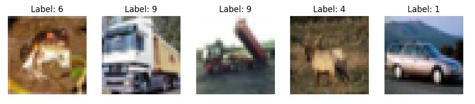
<br>
<br>

Image representation in tensor:

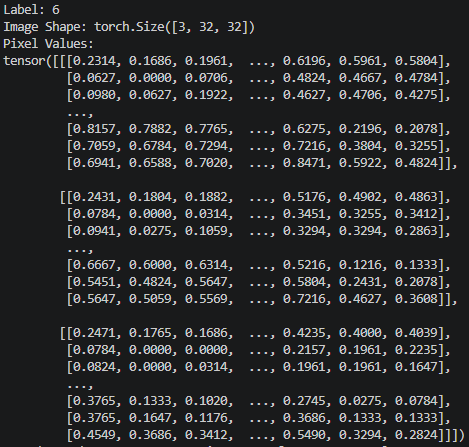
<br>
<br>

Our next step is to set up an environment for building CNNs. So we'll be setting up for both TensorFlow and PyTorch.

```python
# install libraries
## pip install torchvision matplotlib numpy tensorflow

# import libraries
## used for creating visualizations such as charts and plots
import matplotlib.pyplot as plt
## torchvision provides access to popular image datasets 
## Data sets provides access to the popular datasets like CIFAR ten, which we are going to use, or mNIST and others
## Transforms contains utilities to preprocess and transform image data such as converting images to tensors
from torchvision import datasets, transforms
## matrix operation and mathematical function
import numpy as np

## Tensorflow - building and training deep learning models
import tensorflow as tf

# Define a simple CNN (convolutional neural network) model
## This is a sequential model, which means each layer is run one at a time in sequential order
model = tf.keras.Sequential([
    ## Conv2D is a convolutional layer with 32 filters, a 3 by 3 kernel size and a ReLU activation function for the image we have
    tf.keras.layers.Conv2D(32, (3, 3), activation="relu", input_shape=(32, 32, 3)),
    ## This is a max pooling 2D layer with two by two pooling window to reduce the spatial dimensions of the previous input
    tf.keras.layers.MaxPooling2D((2, 2)),
    ## This function flattens the 2D feature maps into a 1D vector for fully connected layers
    tf.keras.layers.Flatten(),
    ## Fully connected layer with 128 neurons and ReLU activation function
    tf.keras.layers.Dense(128, activation="relu"),
    ## Output layer with 10 neurons (ten different classification units we have in CIFAR ten) and softmax activation function
    ## activation="softmax" - activation for classification
    tf.keras.layers.Dense(10, activation="softmax")
])

# Compile the model
## optimizer='adam' - optimization algorithm for training the model
## loss='sparse_categorical_crossentropy' - specifies the loss function for multi-class classification
## metrics=['accuracy'] - metric for evaluating the model - tracks accuracy during the training
model.compile(optimizer='adam', loss='sparse_categorical_crossentropy', metrics=['accuracy'])

## print message when the model is ready
print("Tensorflow CNN Model is ready")


## import Pytorch
import torch
## Pytorch - provides tools for building neural networks
import torch.nn as nn

# Define a simple CNN model
class SimpleCNN(nn.Module):
    ## initializer for the class
    def __init__(self):
        ## call the parent class constructor
        super(SimpleCNN, self).__init__()
        ## create a convolutional layer with 3 input channels, 32 filters and a 3x3 kernel size
        self.conv1 = nn.Conv2d(3, 32, kernel_size=3, activation='relu')
        ## create a max pooling layer with a 2 by 2 pooling window
        self.pool = nn.MaxPool2d(2, 2)
        ## create first fully connected layer, transforming it from 32 * 15 * 15 into 128
        self.fc1 = nn.Linear(32 * 15 * 15, 128)
        ## second layer - converts the input size to the output size. We're transforming 128 neurons and 10 classes.
        self.fc2 = nn.Linear(128, 10)
        
    ## This defines the forward pass
    def forward(self, x):
        ## This applies convolution conv one and ReLU activation
        x = F.relu(self.conv1(x))
        ## Apply max pooling
        x = self.pool(x)
        ## Flatten - converts the 2D feature maps into a 1D vector
        x = x.view(-1, 32 * 15 * 15)
        ## next two lines passes the data through fully connected layers of FC1 and FC2
        x = F.relu(self.fc1(x))
        x = self.fc2(x)

# print message when the model is ready
print("PyTorch CNN model ready")

```

Run the file
    terminal --> python day8_ex.py

Result:

Tensorflow CNN Model is ready   
PyTorch CNN model ready

In this exercise we did the visualization where we understand the structure and labels of the CIFAR10 dataset.

Then we did pixel exploration where we gain insights into the numerical representation of the image.

We displayed the image sizes, then we did the environment setup for both TensorFlow and PyTorch for CNN development, which we'll be using quite a lot in the next few days.


[⬆ Back to content](#content)


## 11. Day 9: Convolutional Layers and Filters

[⬆ Back to content](#content)

Today we're going to jump into understanding convolutional operations filters and feature maps.

**Convolutional Operations, Filters and Feature Maps**

- What is convolutional operation?
  - A mathematical operation where a small matrix (kernel or filter) slides over the input image to extract features like edges, textures or patterns.
  - Key Concepts
    - Kernel(Filter) 
      - A small matrix (example 3x3) used to extract features
      - Each element of the kernel is a weight learned during training
    - Feature Map
      - The output of a convolutional operation
      - Highlights the specific patterns detected by the filter
    - Channels
      - For RGB images convolution processes each color channel separately and combines the results


**Concepts of Kernel size, Stride and Padding**
- Kernel Size
  - The dimension of the filter (example can be 3x3 or 5x5)
  - Smaller Kernels: Capture finer details
  - Larger kernels: Detect broader features
- Stride
  - Defines the step size of the filter as it slides across the input
  - Larger Strides: reduces the feature map size, improving computation efficiency
  - Smaller Strides: retain more detail but increase the competition
- Padding
  - Adds extra pixels around the input to control the size of the output
  - Valid Padding: No Padding; the features map shrinks
  - Same padding: Adds enough padding to keep the output size equal to the input size
  
**Visualizing How Convolution Extracts Features**

- Edge Detection:
  - Kernels like Sobel or Priwitt highlight edges in images
- Feature extraction
  - Initial layers focus on edges; deeper layers capture abstract patterns


**Hands-On Exercise**

Objective: Understand convolution operations by implementing and visualizing their effects using TensorFlow and PyTorch.

day9_ex.py

```python
# insall libraries
## pip install matplotlib numpy scipy

# import libraries
## used for creating visualizations such as charts, plots and images
import matplotlib.pyplot as plt
## essential for numerical computations and handling arrays
import numpy as np
## convolve is used to perform convolution operations on images
from scipy.ndimage import convolve

# Load a sample grayscale image
## generates a ten by ten random grayscale image values between 0 and 1 to simulate an example of an image
image = np.random.rand(10, 10)

# Visualize the effects of convolution on an image
#print(image)


# Define convolution kernels(filters)
## this edge detection kernel is a 3 by 3 kernel filter used for detecting edges in the image by emphasizing high contrast area
edge_detection_kernel = np.array([
    [-1, -1, -1],
    [-1, 8, -1],
    [-1, -1, -1],
])

## Create a blur kernel
## This is a 3x3 kernel used for blurring the image by Averaging the pixel values in a neighborhood
blur_kernel = np.array([
    [1, 1, 1],
    [1, 1, 1],
    [1, 1, 1]
]) / 9                  # normalizing for averaging so the sum of all the elements equals one, ensuring the brightness remains consistent

# Apply Convolution
## apply the convolution operation on the image using the specified kernel
## contains the result of an edge detection kernel
edge_detected_image = convolve(image, edge_detection_kernel)
## contains the result of a blur kernel
blurred_image = convolve(image, blur_kernel)

# Visualize original and filtered image
## creates a figure with 1 row and 3 columns for side by side visualization of the images and fixed size 12x12 four sets the size of the figure to 12in wide and 4in tall
fig, axes = plt.subplots(1, 3, figsize=(12, 4))
## displays the original image on the first subplot with grayscale color map. So it takes the image and shows it in the first axis
axes[0].imshow(image, cmap="gray")
axes[0].set_title("Original Image")
## display the edge detected image on the second subplot
axes[1].imshow(edge_detected_image, cmap="gray")
axes[1].set_title("Edge Detected")
## display the blurred image on the third subplot
axes[2].imshow(blurred_image, cmap="gray")
axes[2].set_title("Blurred")
## show the plot
plt.show()

```

Run the file
    terminal --> python day9_ex.py

Result:

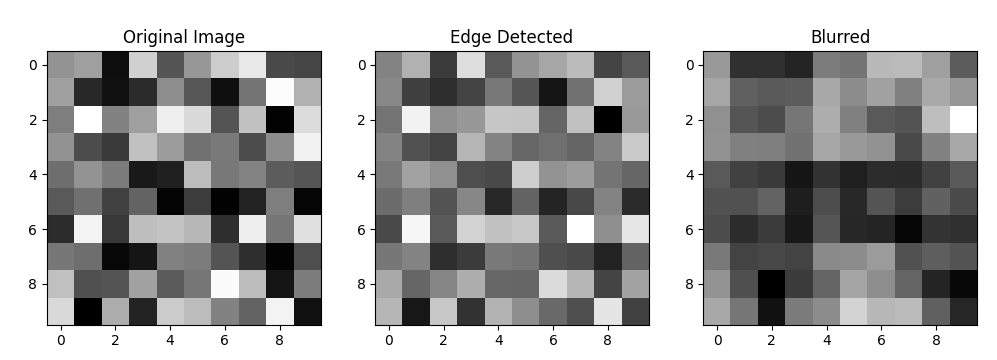
<br>
<br>

This is how you can actually take an image and then detect edges on them and also blur the images.


### Implement convolution in TensorFlow

```python
## Tensorflow - building and training deep learning models
import tensorflow as tf

# Create a sample input tesnor (batch_size, height, width, channels)
## This is a random ten by ten grayscale image
image_tensor = tf.random.normal([1, 10, 10, 1])

# Define a convolutional layer
## Calling this 2D which defines a 2D convolutional layer in TensorFlow
conv_layer = tf.keras.layers.Conv2D(
    filters=1,                          # specifies the number of output channels or filters
    kernel_size=(3,3),                  # defines the size of the convolutional kernel
    strides=(1, 1),                     # specifies the step size of the convolution
    padding='same'                      # ensuring the output size matches the input size by padding the borders
)

# Applying convolution
## Applies the convolution layer to the image tensor
output_tensor = conv_layer(image_tensor)

## Print results
print(f"Original Shape: {image_tensor.shape}")

```

Run the file
    terminal --> python day9_ex.py

Result:

Original Shape: (1, 10, 10, 1)    
Ouput Shape: (1, 10, 10, 1)

We have the original shape 1 10 10 1.   
And output shape is exactly same 1 10 10 1.   
Just the contents might have changed because we have added the convolutional layer on top of it


### Implement convolution in PyTorch

```python
## Tensorflow - building and training deep learning models
import tensorflow as tf

# Create a sample input tesnor (batch_size, height, width, channels)
## This is a random ten by ten grayscale image
image_tensor = tf.random.normal([1, 10, 10, 1])

# Define a convolutional layer
## Calling this 2D which defines a 2D convolutional layer in TensorFlow
conv_layer = tf.keras.layers.Conv2D(
    filters=1,                          # specifies the number of output channels or filters
    kernel_size=(3,3),                  # defines the size of the convolutional kernel
    strides=(1, 1),                     # specifies the step size of the convolution
    padding='same'                      # ensuring the output size matches the input size by padding the borders
)

# Applying convolution
## Applies the convolution layer to the image tensor
output_tensor = conv_layer(image_tensor)

## Print results
print(f"Original Shape: {image_tensor.shape}")
print(f"Ouput Shape: {output_tensor.shape}")

## import Pytorch
import torch
## Torch's main library
import torch.nn as nn

# Create a sample input tensor (batch_size, channels, height, width)
## This is q random 10x10 grayscale image
image_tensor_pt = torch.randn(1, 1, 10, 10)

# Define a convolutional layer
## Calling this 2D which defines a 2D convolutional layer in Pytorch
conv_layer_pt = nn.Conv2d(
    in_channels=1,              # number of input channels
    out_channels=1,             # number of output channels
    kernel_size=3,              # size of the convolutional kernel
    stride=1,                   # stride of the convolution
    padding=1                   # padding of the convolution
)

# APply Convolution
## Applies the convolution layer to the image tensor pytorch
output_tensor_pt = conv_layer_pt(image_tensor_pt)

## Print results
print(f"Original Shape: {image_tensor_pt.shape}")
print(f"Oytput Shape: {output_tensor_pt.shape}")

## We can experiment with different kernel sizes, strides, and padding to see how they affect the output shape

# TensorFlow Example
conv_layer_large_kernel = tf.keras.layers.Conv2D(filters=1, kernel_size=(5, 5), strides=(1, 1), padding="same")
output_large_kernel = conv_layer_large_kernel(image_tensor)
## Print results for TensorFlow
print(f"Large Kernel Output Shape: {output_large_kernel.shape}")

# Pytorch Example
conv_layer_stride_2 = nn.Conv2d(in_channels=1, out_channels=1, kernel_size=3, stride=2, padding=1)
output_stride_2 = conv_layer_stride_2(image_tensor_pt)
## Print results for Pytorch
print(f"Stride Output Shape: {output_stride_2.shape}")

```

Run the file
    terminal --> python day9_ex.py

Result:

Original Shape: (1, 10, 10, 1)    
Ouput Shape: (1, 10, 10, 1)   
Original Shape: torch.Size([1, 1, 10, 10])    
Oytput Shape: torch.Size([1, 1, 10, 10])    
Large Kernel Output Shape: (1, 10, 10, 1)   
Stride Output Shape: torch.Size([1, 1, 5, 5])   

And then here is our large kernel. And with that the data that I'm getting out stride output, I'm getting half the value of the input because it strides twice the amount it skips once. So that's why it's smaller output shape.

We learned the effect of kernel size, stride and padding on image processing. We gained some hands-on experience with TensorFlow and PyTorch for implementing these convolutional layers, and developed intuition for choosing hyperparameters for convolutional operations.

[⬆ Back to content](#content)


## 12. Day 10: Pooling Layers and Dimensionality Reduction

[⬆ Back to content](#content)


**Introduction to Pooling Layers**

- What are pooling layers?
  - Pooling layers are used to reduce the dimensions of feature maps while retaining the most important information
  - Help make the network computationally efficient and robust to variations in the input
  - Types of Pooling
    - Max Pooling
      - Selects the maximum value for each region of the input feature map
      - Captures the strongest activations(features)
    - Average Pooling
      - Computes the average value for each region of the input feature map
      - Provides a more generalized summary of features


**Role of Pooling in Reducing Dimensionality**

- Dimensionality Reducing
  - Pooling reduces the spatial dimensions, height and width of feature maps, resulting in fewer parameters and faster computations
  - Robustness
    - Makes the model invariant to small translations or distortions in the input image


**Combining Convolution and Pooling Layers**

- Pooling layers typically follow convolutional layers to downsample the feature maps
- This combination helps extract hierarchical features
  - Early layers focus on simple features (Example: edges)
  - Deeper layers capture complex patterns (Example: objects)


**Hands-On Exercise**

Objective: Implement max pooling and average pooling layers on feature maps and observe their effects on size and representation. 

We are going to use colorful images this time.


day10_ex.py

```python
# install libraries
## pip install matplotlib numpy scipy torch tensorflow

## essential for numerical computations and handling arrays
import numpy as np
## used for visualizing the feature maps
import matplotlib.pyplot as plt
## import maximum_filter for max pooling and uniform_filter for average pooling
from scipy.ndimage import maximum_filter, uniform_filter

# Create a sample feature map
## It defines 4x4 2D array feature map as a sample feature set
feature_map = np.array([
    [1, 2, 3, 0],
    [4, 5, 6, 1],
    [7, 8, 9, 2],
    [0, 1, 2, 3]
])

# Max pooling (2X2)
## We are performing max pooling with a 2x2 kernel size, and each region in the feature map is replaced with its maximum value
## mode='constant' to pad with zeros
## size=2 is the size of the pooling window
max_pooled = maximum_filter(feature_map, size=2, mode='constant')

# Average pooling (2X2)
## We perform average pooling with a 2x2 kernel size and each region is replaced with the average of its values
avg_pooled = uniform_filter(feature_map, size=2, mode='constant')

# Plot
## creates a figure with 1 row and 3 columns for side by side visualization of the images and fixed size 12x12 four sets the size of the figure to 12in wide and 4in tall
fig, axes = plt.subplots(1, 3, figsize=(12, 4))
## displays the original image on the first subplot with grayscale color map. So it takes the image and shows it in the first axis
axes[0].imshow(feature_map, cmap='viridis')
axes[0].set_title("Original Feature Map")
## display the edge detected image on the second subplot
axes[1].imshow(max_pooled, cmap='viridis')
axes[1].set_title("Max Pooled")
## display the blurred image on the third subplot
axes[2].imshow(avg_pooled, cmap='viridis')
axes[2].set_title("Average Pooled")
plt.show()

```

Run the file
    terminal --> python day10_ex.py

Result:

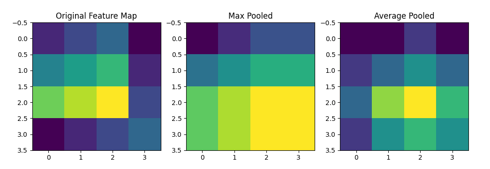
<br>
<br>


### Implement the pooling layers in TensorFlow and PyTorch

If we want to combine the convolution and pooling layers, let's look at an example using TensorFlow.

For that We are going to do it for both TensorFlow and PyTorch.

```python
# install libraries
## pip install matplotlib numpy scipy torch tensorflow

## essential for numerical computations and handling arrays
import numpy as np
## used for visualizing the feature maps
import matplotlib.pyplot as plt
## import maximum_filter for max pooling and uniform_filter for average pooling
from scipy.ndimage import maximum_filter, uniform_filter

# Create a sample feature map
## It defines 4x4 2D array feature map as a sample feature set
feature_map = np.array([
    [1, 2, 3, 0],
    [4, 5, 6, 1],
    [7, 8, 9, 2],
    [0, 1, 2, 3]
])

# Max pooling (2X2)
## We are performing max pooling with a 2x2 kernel size, and each region in the feature map is replaced with its maximum value
## mode='constant' to pad with zeros
## size=2 is the size of the pooling window
max_pooled = maximum_filter(feature_map, size=2, mode='constant')

# Average pooling (2X2)
## We perform average pooling with a 2x2 kernel size and each region is replaced with the average of its values
avg_pooled = uniform_filter(feature_map, size=2, mode='constant')

# # # Plot
# # ## creates a figure with 1 row and 3 columns for side by side visualization of the images and fixed size 12x12 four sets the size of the figure to 12in wide and 4in tall
# # fig, axes = plt.subplots(1, 3, figsize=(12, 4))
# # ## displays the original image on the first subplot with grayscale color map. So it takes the image and shows it in the first axis
# # axes[0].imshow(feature_map, cmap='viridis')
# # axes[0].set_title("Original Feature Map")
# # ## display the edge detected image on the second subplot
# # axes[1].imshow(max_pooled, cmap='viridis')
# # axes[1].set_title("Max Pooled")
# # ## display the blurred image on the third subplot
# # axes[2].imshow(avg_pooled, cmap='viridis')
# # axes[2].set_title("Average Pooled")
# # plt.show()


## Tensorflow - building and training deep learning models
import tensorflow as tf

# Create a sample input tensor (1X4x4X1 for batch size, height, width, channels)
## We've converted the feature map into a 4D tensor with dimensions of batch size, height, width and channels
input_tensor = tf.constant(feature_map.reshape(1, 4, 4, 1), dtype=tf.float32)

# Max Pooling
## max pool variable - Defining a 2x2 max pooling layer with stride of 2
max_pool = tf.keras.layers.MaxPooling2D(pool_size=(2, 2), strides=2, padding='valid')
## apply the pooling to the input tensor
max_pooled_tensor = max_pool(input_tensor)

# Avg Pooling
## avg pool variable - Defined a 2x2 average pooling layer with strides of 2
avg_pool = tf.keras.layers.AveragePooling2D(pool_size=(2, 2), strides=2, padding='valid')
## apply average pooling to the input tensor
avg_pooled_tensor = avg_pool(input_tensor)

# Print results
print(f"Max Pooled Tensor:\n{tf.squeeze(max_pooled_tensor).numpy()}")
print(f"Average Pooled Tensor:\n{tf.squeeze(avg_pooled_tensor).numpy()}")
print("\n\n\n")

## import Pytorch
import torch
## Pytorch - provides tools for building neural networks
import torch.nn as nn

# Create a sample input tensor (batch_size, channels, height, width)
## We are converting the feature map to a 4D tensor with dimensions of batch size, channels, height and width and then we have to unsqueeze it twice.
input_tensor = torch.tensor(feature_map, dtype=torch.float32).unsqueeze(0).unsqueeze(0)

# Max Pooling
max_pool = nn.MaxPool2d(kernel_size=2, stride=2)
max_pooled_tensor = max_pool(input_tensor)

# Average Pooling
avg_pool = nn.AvgPool2d(kernel_size=2, stride=2)
avg_pooled_tensor = avg_pool(input_tensor)

# Print results
print(f"Max Pooled Tensor:\n{max_pooled_tensor.squeeze().numpy()}")
print(f"Average Pooled Tensor:\n{avg_pooled_tensor.squeeze().numpy()}")

# TensorFlow Example
## This is a sequential model, which means each layer is run one at a time in sequential order
model_tf = tf.keras.Sequential([
    tf.keras.Input(shape=(32, 32, 3)),
    tf.keras.layers.Conv2D(32, (3, 3), activation='relu'),
    tf.keras.layers.MaxPooling2D((2,2)),
    tf.keras.layers.Conv2D(64, (3, 3), activation='relu'),
    tf.keras.layers.AveragePooling2D((2, 2))
])

# Pytorch example
class SimpleCNN(torch.nn.Module):
    def __init__(self):
        super(SimpleCNN, self).__init__()
        self.conv1 = nn.Conv2d(3, 32, kernal_size=3)
        self.pool1 = nn.MaxPool2d(2, 2)
        self.conv2 = nn.Conv2d(32, 64, kernal_size=3)
        self.pool2 = nn.AvgPool2d(2, 2)
        
    def forward(self, x):
        x = torch.relu(self.conv1(x))
        x = self.pool1(x)
        x = torch.relu(self.conv2(x))
        x = self.pool2(x)
        return x

```

Run the file
    terminal --> python day10_ex.py

Result:

Max Pooled Tensor:    
[[5. 6.]    
 [8. 9.]]   
Average Pooled Tensor:    
[[3.  2.5]    
 [4.  4. ]]   

Max Pooled Tensor:    
[[5. 6.]    
 [8. 9.]]   
Average Pooled Tensor:    
[[3.  2.5]    
 [4.  4. ]]   


We learned the purpose and functionality of pooling layers in CNNs. We understood the tradeoffs between max pooling and average pooling. We developed some practical skills for implementing pooling layers in TensorFlow and PyTorch and gained an intuition for how pooling reduces computation and enhances feature extraction.


[⬆ Back to content](#content)


## 13. Day 11: Building CNN Architectures with Keras and TensorFlow

[⬆ Back to content](#content)

**Building a CNN Architecture in Keras**

- Steps to Build a CNN
  - Convolutional Layers: Extract features from the input images
  - Pooling Layers: Downsample feature maps to reduce dimensions and retain key features
  - Dense (Fully Connected) Layers: Combine features for final predictions
- Basic CNN Architecture
  - Input Layer --> Convolutional Layer --> Activation --> Pooling --> Fully Connected Layer --> Output Layer
  - Repeat the convolution and pooling layers for deeper networks


**Compiling, Training and Evaluating CNN**

- Steps
  - Compile the Model
    - Define loss optimizer and metrics
    - Example loss functions
      - Categorical Cross-Entropy: Multi-class classification
    - Example Optimizers
      - Adam: Efficient optimization for large networks
    - Example metrics: Accuracy
  - Train the Model
    - Use model.fit() with training data, validation data, epochs and batch size
  - Evaluate the Model
    - Use model.evaluate() with test data to calculate metrics


**Introduction to Popular CNN Architectures**

- LeNet
  - One of the earliest CNNs for handwritten digit classifications (Example is MNIST)
- AlexNet
  - Revolutionized deep learning for image classification in 2012
  - Introduced ReLU activation and dropout for regularization
- VGG
  - Uses deep networks with small filters (mostly 3x3)
  - Known for its simplicity and effectiveness


**Hands-On Exercise**

Objective: Build, train and evaluate a CNN for image classification on MNIST or CIFAR-10 dataset using Keras and TensorFlow.

We will start with CIFAR-10

day11_ex.py

```python
# Install Libraries
## pip install tensorflow matplotlib

# import libraries
## Import the cipher ten data set, which consists of 60,032 by 32 color images in ten classes where we will be dividing it, 50,000 for training and 10,000 for testing samples.
from tensorflow.keras.datasets import cifar10
## This imports a utility to convert integer labels to one hot encoded labels
from tensorflow.keras.utils import to_categorical
## Tensorflow - building and training deep learning models
import tensorflow as tf

## Tensorflow - building and training deep learning models
from tensorflow.keras.models import Sequential
## Conv2D is a convolutional layer with 32 filters, a 3 by 3 kernel size and a ReLU activation function
## MaxPooling2D is a max pooling 2D layer with two by two pooling window
## Flatten is a function that flattens the 2D feature maps into a 1D vector for fully connected layers
## Dense is a fully connected layer with 128 neurons and ReLU activation function
## Dropout is a dropout layer to prevent overfitting
from tensorflow.keras.layers import Conv2D, MaxPooling2D, Flatten, Dense, Dropout

# Load CIFAR-10 dataset
## This loads the data set and splits it into training which is X_train and y_train and testing into X_test and y_test sets 
## X_train and X_test contain image data, while y_train and y_test contain the corresponding labels for those images
(X_train, y_train), (X_test, y_test) = cifar10.load_data()

# Normalize the data
## This converts the image data to a 32 bit floating point number for compatibility with TensorFlow models 
## divide it by 250 5.0, it normalizes the pixel values from 0 to 255 to 0 to 1 to improve model convergence during the training process
X_train = X_train.astype('float32') / 255.0
## same for test data
X_test = X_test.astype('float32') / 255.0

# One-hot encode the labels
## For example a label for 3 will become 00010000 because it will kind of label the third element in the list as one
y_train = to_categorical(y_train, 10)
y_test = to_categorical(y_test, 10)

# Print shapes of the data
print(f"Training Data Shape: {X_train.shape}, Label Shapes: {y_train.shape}")
print(f"Test Data Shape: {X_test.shape}, Label Shapes: {y_test.shape}")

# Build the CNN model
model = Sequential([
    ## Adds a convolution layer with 32 filters, kernel size 3x3 
    ## Adds ReLU activation and input shape of 32 x 32 x 3, which is the image size and RGB channels
    Conv2D(32, (3, 3), activation='relu', input_shape=(32,32,3)),       # 32 filters, 3x3 kernel size, ReLU activation, input shape
    ## Adds a 2x2 max pooling layer to reduce the spatial dimensions
    MaxPooling2D((2, 2)),                                               # 2x2 pooling window
    ## Adds a second convolution layer with 64 filters, kernel size 3x3 and ReLU activation
    Conv2D(64, (3, 3), activation='relu'),
    ## Adds a 2x2 max pooling layer to reduce the spatial dimensions
    MaxPooling2D((2, 2)),
    ## This flattens the 2D features map into a 1D array for fully connected layers - Flatten the 2D feature maps into a 1D vector
    Flatten(),
    ## This creates that fully connected layer with 128 units and ReLU activation
    Dense(128, activation='relu'),
    ## adds dropout layer - Regularization with 50% dropout to prevent the overfitting part 
    Dropout(0.5),
    ## Create the output layer with 10 units, one for each class and softmax activation for classification
    Dense(10, activation='softmax')
])

# diplay model summary/architecture
model.summary()

# Compile the model
model.compile(
    optimizer='adam',                   # Efficient optimization for large networks
    loss='categorical_crossentropy',    # Categorical Cross-Entropy Loss
    metrics=['accuracy']                # Accuracy metric for model evaluation
)

# Train the model
history = model.fit(
    X_train, y_train,           # Training data
    epochs=10,                  # Number of training epochs - each epoch is a full pass through the training data
    batch_size=64,              # Batch size - Number of samples per gradient update
    validation_split=0.2        # Validation split - 20% of the training data will be used for validation
)

# Evaluate on the test dataset
## Evaluate the model on the test datasets
test_loss, test_accuracy = model.evaluate(X_test, y_test)
## Print the test accuracy
print(f"Test Accuracy: {test_accuracy:.4f}")

# import matplotlib for visualization of the results
import matplotlib.pyplot as plt

# Plot Accuracy
plt.plot(history.history['accuracy'], label="Training Accuracy")
plt.plot(history.history['val_accuracy'], label="Validation Accuracy")
plt.title("Model Accuracy")
plt.xlabel('Epochs')
plt.ylabel('Accuracy')
plt.legend()
plt.show()


# Plot Loss
plt.plot(history.history['loss'], label="Training Loss")
plt.plot(history.history['val_loss'], label="Validation Loss")
plt.title("Model Loss")
plt.xlabel('Epochs')
plt.ylabel('Loss')
plt.legend()
plt.show()
```

Run the file
    terminal --> python day11_ex.py

Result:


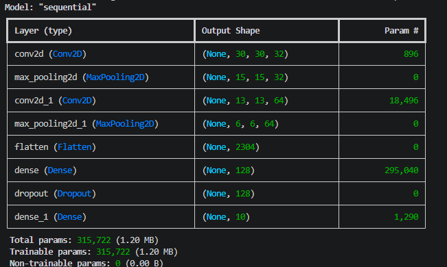
<br>
<br>

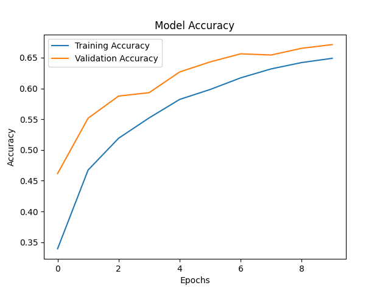
<br>
<br>

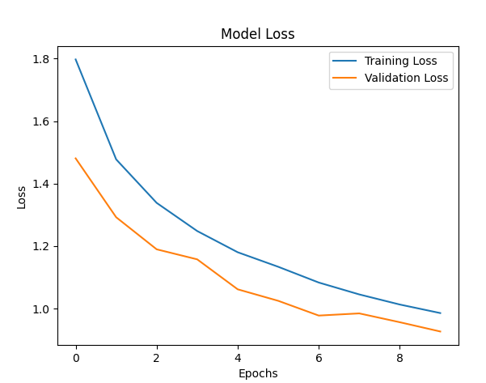
<br>
<br>

Test Accuracy: 0.6743


[⬆ Back to content](#content)


## 14. Day 12: Building CNN Architectures with PyTorch

[⬆ Back to content](#content)

**Building CNN Architecture in PyTorch Using the nn Module**

- Key Steps
  - Define a Model
    - Use torch.nn.Module to build CNN layers like convolutional pooling and fully connected layers
  - Forward Pass
    - Define how the input flows through the layers to produce the output
  - Model Summary
    - Inspect the structure and learnable parameters


**Training and Evaluation of CNN in PyTorch**

- Training
  - Perform forward and backward passes, calculate loss and update weights using an optimizer
- Evaluation
  - Test the model on unseen data and compute metrics like accuracy and loss


**Experimenting with CNN Model Design and Tuning Hyperparameters**

- Experimentation Area
  - Layer Depth
    - Add or remove some convolutional and pooling layers to observe the impact
  - Filter Size
    - Experiment with kernel sizes(Example 3x3 or 5x5)
  - Learning Rate
    - Adjust the learning rate to improve convergence, speed and accuracy


**Hands-On Exercise**

Objective: build, train, evaluate and experiment with CNNs for CIFAR-10 classification using PyTorch.

day12_ex.py

```python

## Import Pytorch - provides tools for building neural networks
import torch
## torchvision provides access to popular image datasets, transforms contains utilities to preprocess and transform image data
from torchvision import datasets, transforms
## DataLoader is used to load data in batches
from torch.utils.data import DataLoader
## torch.nn is used for building neural networks
import torch.nn as nn
## torch.nn.functional is used for applying activation functions
import torch.nn.functional as F
## torch.optim is used for optimizing the model
import torch.optim as optim

# Define Transformation
## This is our transformation that will be available to use in the process when we load the data
transform = transforms.Compose([
    ## Defines a transformation to convert images from the data set into PyTorch tensors. This is necessary for using the data in PyTorch models.
    transforms.ToTensor(),
    ## Normalize the image - subtract mean and divide by standard deviation
    transforms.Normalize((0.5, 0.5, 0.5), (0.5, 0.5, 0.5))
])

# Load CIFAR-10 dataset
## Training dataset
train_dataset = datasets.CIFAR10(root="./data", train=True, download=True, transform=transform)
## Test dataset
test_dataset = datasets.CIFAR10(root="./data", train=False, download=True, transform=transform)

# Create data Loaders
train_loader = DataLoader(train_dataset, batch_size=64, shuffle=True)
test_loader = DataLoader(test_dataset, batch_size=64, shuffle=False)

print(f"Training Data Size: {len(train_dataset)}")
print(f"Test Data Size: {len(test_dataset)}")

# Define a CNN Model
class CNN(nn.Module):
    ## Initializer
    def __init__(self):
        ## Call the parent class
        super(CNN, self).__init__()
        ## Define the first layer convolutional layer
        self.conv1 = nn.Conv2d(3, 6, 5)
        ## Define a max pooling layer with a 2 by 2 pooling window
        self.pool = nn.MaxPool2d(2, 2)
        ## Define the third layer convolutional layer
        self.conv2 = nn.Conv2d(6, 16, 5)
        ## Define the fully connected layers
        ## first fully connected layer, transforming it from 16 * 5 * 5 into 120
        self.fc1 = nn.Linear(16 * 5 * 5, 120)
        ## second layer - converts the input size to the output size. We're transforming 120 neurons and 84 classes
        self.fc2 = nn.Linear(120, 84)
        ## third layer - converts the input size to the output size. We're transforming 84 neurons and 10 classes
        self.fc3 = nn.Linear(84, 10)
        
    ## This defines the forward pass
    def forward(self, x):
        x = self.pool(torch.relu(self.conv1(x)))
        x = self.pool(torch.relu(self.conv2(x)))
        x = x.view(-1, 16 * 5 * 5)
        x = torch.relu(self.fc1(x))
        x = torch.relu(self.fc2(x))
        x = self.fc3(x)
        return x

## Create the model
model = CNN()
## Print the model
print(model)
        
# Define loss function and optimize
## Cross Entropy Loss - used for classification problems
criterion = nn.CrossEntropyLoss()
## Stochastic Gradient Descent optimizer
# optimizer = optim.SGD(model.parameters(), lr=0.01, momentum=0.9)
## Adam optimizater
optimizer = optim.Adam(model.parameters(), lr=0.001)    # lower learning rate is more stable and converges faster for better results

# Training Loop
def train_model(model, train_loader, criterion, optimizer, epochs=10):
    model.train()
    for epoch in range(epochs):
        running_loss = 0.0
        for images, labels in train_loader:
            # Zero gradient - reset gradients
            optimizer.zero_grad()
            
            # Forward Pass
            outputs = model(images)
            loss = criterion(outputs, labels)
            
            # Backward pass and optimize
            loss.backward()
            optimizer.step()
            
            running_loss += loss.item()
        print(f"Epoch {epoch+1}, Loss; {running_loss/len(train_loader):.4f}")

## Train the model
train_model(model, train_loader, criterion, optimizer)

# Evaluation loop
def evaluate_model(model, test_loader):
    model.eval()
    correct = 0
    total = 0
    with torch.no_grad():
        for images, labels in test_loader:
            outputs = model(images)
            _, predicted = torch.max(outputs, 1)
            total += labels.size(0)
            correct += (predicted == labels).sum().item()
    print(f"Test Accuracy: {100 * correct / total:.2f}%")
    
evaluate_model(model, test_loader)

```

Run the file
    terminal --> python day12_ex.py

Result:

Results with Adam optimizer and 0.001 learning rate:

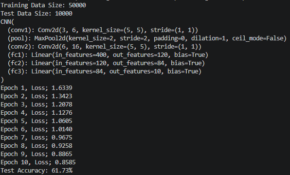
<br>
<br>

Results with SGD (Stochastic Gradient Descent) optimizer, 0.01 learning rate and 0.9 momentum:

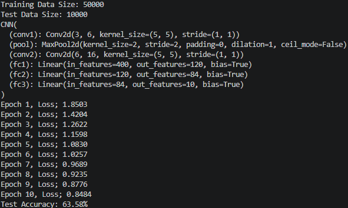
<br>
<br>

We learned how to build CNN architectures using PyTorch. We understood the training and evaluation workflow in PyTorch. Furthermore, we developed skills in experimenting with model designs and hyperparameters and we gained some practical experience with CIFAR-10 dataset for image classification.


[⬆ Back to content](#content)


## 15. Day 13: Regularization and Data Augmentation for CNNs

[⬆ Back to content](#content)


**Overfitting in CNNs and Methods to Prevent It**

- What is overfitting?
  - Overfitting occurs when a model performs well on the training data, but fails to generalize to the unseen data
  - In CNNs, overfitting is common due to the large number of parameters in deep networks
  - Methods to prevent overfitting:
    - Dropout
      - Randomly sets a fraction of neurons to zero during training
      - Prevents co-adaptation of neurons 
      - Controlled by dropout rate (example 0.5)
    - Batch Normalization
      - Normalizes the input of each layer to stabilize training
      - Reduces internal covariate shift and allows higher learning rates
    - Data Augmentation 
      - Increases dataset size artificially by applying transformations to images
      - Examples: Rotation, Flipping, Scaling, Cropping, Brightness adjustment


**Introduction to Data Augmentation Techniques**

- Common Techniques
  - Rotation
    - Rotates the image by a specified angle range (example =30* to 30*)
  - Flipping
    - Horizontally or vertically flips the image
  - Scaling
    - Resizes the image by zooming in or out
  - Cropping 
    - Extracts random portions of the image


**Implementing Regularization and Data Augmentation in CNN Training**

- Why use both?
  - Regularization reduces the complexity of the model
  - Data augmentation increases the diversity of the training data, improving the generalization


**Hands-On Exercise**

Objective: Apply dropout, batch normalization and data augmentation to improve CNN performance.

day13_ex.py

```python
## Tensorflow - building and training deep learning models
import tensorflow as tf
from tensorflow.keras import layers, models
## cifar10 dataset
from tensorflow.keras.datasets import cifar10
## ImageDataGenerator - used for data augmentation
from tensorflow.keras.preprocessing.image import ImageDataGenerator
## used for creating visualizations such as charts and plots
import matplotlib.pyplot as plt

# Load CIFAR-10 dataset
## This loads the data set and splits it into training which is X_train and y_train and testing into X_test and y_test sets 
## X_train and X_test contain image data, while y_train and y_test contain the corresponding labels for those images
(x_train, y_train), (x_test, y_test) = cifar10.load_data()

# Normalize pixel values to the range [0, 1]
## This converts the image data to a 32 bit floating point number for compatibility with TensorFlow models 
## divide it by 250 5.0, it normalizes the pixel values from 0 to 255 to 0 to 1 to improve model convergence during the training process
x_train = x_train.astype('float32') / 255.0
## same for test data
x_test = x_test.astype('float32') / 255.0

# One-hot encode the labels
## For example a label for 3 will become 00010000 because it will kind of label the third element in the list as one
y_train = tf.keras.utils.to_categorical(y_train, 10)
y_test = tf.keras.utils.to_categorical(y_test, 10)

# Apply data augmentation
datagen = ImageDataGenerator(
    rotation_range=15,                  # Rotate images by up to 15 degrees
    width_shift_range=0.1,              # Shift images horizontally by up to 10%
    height_shift_range=0.1,             # Shift images vertically by up to 10%
    horizontal_flip=True                # Flip images horizontally
)

# Fit the generator to training data
datagen.fit(x_train)

# Create the model architecture
def create_model():
    # Initializes a sequential model which allows layers to be stacked linearly
    model = models.Sequential()
    
    # Convolutional Layer 1
    model.add(layers.Input(shape=(32, 32, 3)))
    model.add(layers.Conv2D(32, (3, 3), activation='relu'))
    model.add(layers.BatchNormalization())
    model.add(layers.Conv2D(32, (3, 3), activation='relu'))
    model.add(layers.BatchNormalization())
    model.add(layers.MaxPooling2D((2, 2)))
    model.add(layers.Dropout(0.25))
    
    # Convolutional Layer 2
    model.add(layers.Conv2D(64, (3, 3), activation='relu'))
    model.add(layers.BatchNormalization())
    model.add(layers.Conv2D(64, (3, 3), activation='relu'))
    model.add(layers.BatchNormalization())
    model.add(layers.MaxPooling2D((2, 2)))
    model.add(layers.Dropout(0.25))
    
    # Fully connected layers
    model.add(layers.Flatten())
    model.add(layers.Dense(512, activation='relu'))
    model.add(layers.BatchNormalization())
    model.add(layers.Dropout(0.5))
    model.add(layers.Dense(10, activation='softmax'))
    
    return model
    
# Create the model
model = create_model()

# Compile the model
## optimizer='adam' - optimization algorithm for training the model
## loss='categorical_crossentropy' - specifies the loss function for multi-class classification
## metrics=['accuracy'] - metric for evaluating the model - tracks accuracy during the training
model.compile(optimizer='adam', loss='categorical_crossentropy', metrics=['accuracy'])

# Train the model using the augmented data generator
history = model.fit(
    datagen.flow(x_train, y_train, batch_size=64),          # Use the data generator to generate batches of augmented data
    epochs=20,                                              # Number of training epochs
    validation_data=(x_test, y_test),                       # Use the test data for validation
    steps_per_epoch=x_train.shape[0] // 64                  # Number of batches per epoch
)

# Evaluate the model
test_loss, test_accuracy = model.evaluate(x_test, y_test, verbose=2)
print(f"Test Accuracy: {test_accuracy:.2f}")

# Plot accuracy and loss over epochs
plt.plot(history.history['accuracy'], label='Training Accuracy')
plt.plot(history.history['val_accuracy'], label='Validation Accuracy')
plt.xlabel('Epochs')
plt.ylabel('Accuracy')
plt.title("Training and Validation Accuracy")
plt.legend()
plt.show()

# Plot loss over epochs
plt.plot(history.history['loss'], label='Training Loss')
plt.plot(history.history['val_loss'], label='Validation Loss')
plt.xlabel('Epochs')
plt.ylabel('Loss')
plt.title("Training and Validation Loss")
plt.legend()
plt.show()
```

Run the file
    terminal --> python day13_ex.py

Results:

Our graph here which shows the training and validation accuracy. When we train more, the accuracy is increasing.

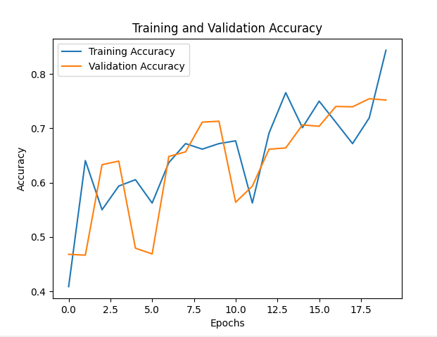
<br>
<br>

Our training and validation loss where depending on how much training we do, it kind of keeps in reducing the loss.

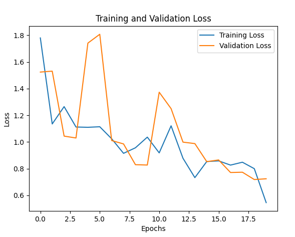
<br>
<br>

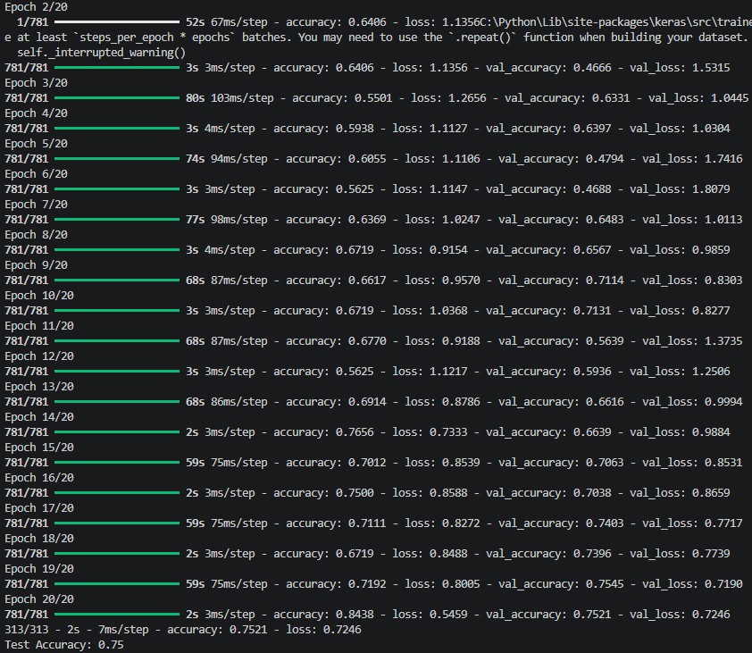
<br>
<br>

We learnt and understood how dropout and batch normalization prevents overfitting. In CNNs. We learned to apply data augmentation techniques to enhance model generalization. We gain practical experience implementing regularization and augmentation in TensorFlow and we developed intuition for experimenting with regularization rates and augmentation strategies.

[⬆ Back to content](#content)


## 16. Day 14: CNN Project – Image Classification on Fashion MNIST or CIFAR-10

[⬆ Back to content](#content)


**Applying CNN Architecture on a Larger Dataset**

- Why larger datasets?
  - Larger data sets like CIFAR-10 or Fashion MNIST represent more realistic and diverse challenges compared to toy datasets like MNIST.
  - They require deeper architectures, careful regularization and augmentation for optimal performance.


**Experimenting with Architecture Design, Regularization and Augmentation**

- Key Techniques to Improve Performance
  - Architecture Modifications
    - Add more convolutional layers or change your kernel sizes
    - Use more filters in deeper layers to capture complex features
  - Regularization
    - Applied dropout in dense layers and batch normalization in convolutional layers
    - Prevent overfitting in deeper models
  - Data Augmentation
    - Use techniques like random flipping, cropping, and rotation to improve generalization


**Analyzing Model Performance and Tuning**

- Evaluation Metrics
  - Accuracy: Overall classification correctness
  - Loss: Measures the difference between predictions and ground truth
  - Confusion matrix: Highlights misclassified classes for deeper insights

**Hands-On Exercise**

Objective: Build, Train and optimizing a CNN for Fashion MNIST or CIFAR-10 image classification, experimenting with regularization and data augmentation to achieve the best performance

Recommend trying out to work with the fashion MNIST data set to do the same.

day14_ex.py

```python
## Import Pytorch - provides tools for building neural networks
import torch
## torchvision provides access to popular image datasets, transforms contains utilities to preprocess and transform image data
from torchvision import datasets, transforms
## DataLoader is used to load data in batches
from torch.utils.data import DataLoader
## torch.nn is used for building neural networks
import torch.nn as nn
## torch.nn.functional is used for applying activation functions
import torch.nn.functional as F
## torch.optim is used for optimizing the model
import torch.optim as optim

# Define transformation with data augmentation
## This transformation trains the model by applying random transformations to the training data
transform_train = transforms.Compose([
    transforms.RandomHorizontalFlip(),                          # Random horizontal flip
    transforms.RandomCrop(32, padding=4),                       # Random crop with padding
    transforms.ToTensor(),                                      # Convert to PyTorch tensor
    transforms.Normalize((0.5, 0.5, 0.5), (0.5, 0.5, 0.5))      # Normalize the image - subtract mean and divide by standard deviation
])

# Define transformation without data augmentation
## This transformation evaluates the model on the test data
transform_test = transforms.Compose([
    transforms.ToTensor(),
    transforms.Normalize((0.5, 0.5, 0.5), (0.5, 0.5, 0.5))
])

# Load CIFAR-10 dataset
train_dataset = datasets.CIFAR10(root="./data", train=True, download=True, transform=transform_train)
test_dataset = datasets.CIFAR10(root="./data", train=False, download=True, transform=transform_test)

# Create data Loaders
train_loader = DataLoader(train_dataset, batch_size=64, shuffle=True)
test_loader = DataLoader(test_dataset, batch_size=64, shuffle=False)

# Print dataset sizes
print(f"Training Data Size: {len(train_dataset)}")
print(f"Test Data Size: {len(test_dataset)}")

# Define a CNN Architecture
class EnhancedCNN(nn.Module):
    def __init__(self):
        super(EnhancedCNN, self).__init__()
        # Define the first convolutional layer
        self.conv1 = nn.Conv2d(3, 6, 5)
        # Define a batch normalization layer
        self.bn1 = nn.BatchNorm2d(6)
        # Define the second convolutional layer
        self.conv2 = nn.Conv2d(6, 16, 5)
        # Define a batch normalization layer
        self.bn2 = nn.BatchNorm2d(16)
        # Define a max pooling layer
        self.pool = nn.MaxPool2d(2, 2)
        # Define a dropout layer
        self.dropout = nn.Dropout(0.5)
        
        # Calculate the size of the output from the convolutional layers dynamically
        self._calculate_conv_output()
        
        # Define the fully connected layers
        ## first fully connected layer
        self.fc1 = nn.Linear(self.conv_output_size, 120)
        ## second layer - converts the input size to the output size. We're transforming 120 neurons and 84 classes
        self.fc2 = nn.Linear(120, 84)
        ## third layer - converts the input size to the output size. We're transforming 84 neurons and 10 classes
        self.fc3 = nn.Linear(84, 10)
    
    def _calculate_conv_output(self):
        # Dummy input tensor with the same size as the input images
        dummy_input = torch.zeros(1, 3, 32, 32)     # Size, channels and height and width
        with torch.no_grad():
            output = self.pool(F.relu(self.bn2(self.conv2(F.relu(self.bn1(self.conv1(dummy_input)))))))
        self.conv_output_size = output.numel()

    # Define the forward pass
    def forward(self, x):
        x = F.relu(self.bn1(self.conv1(x)))                 # Apply ReLU activation
        x = self.pool(F.relu(self.bn2(self.conv2(x))))      # Apply max pooling
        x = x.view(x.size(0), -1)                           # Flattening the tensor dynamically
        x = F.relu(self.fc1(x))                             # Fully connected layer
        x = self.dropout(x)                                 # Apply dropout
        x = F.relu(self.fc2(x))                             # Fully connected layer
        x = self.fc3(x)                                     # output layer
        return x

# Create the model
model = EnhancedCNN()
# Print the model
print(model)

# Define loss function and optimizer
criterion = nn.CrossEntropyLoss()
optimizer = optim.Adam(model.parameters(), lr=0.001)

training_loss = []

# Training Loop
def train_model(model, train_loader, criterion, optimizer, epochs=20):
    model.train()
    for epoch in range(epochs):
        running_loss = 0.0
        for images, labels in train_loader:
            optimizer.zero_grad()
            outputs = model(images)
            loss = criterion(outputs, labels)
            loss.backward()
            optimizer.step()
            running_loss += loss.item()
        epoch_loss = running_loss / len(train_loader)
        training_loss.append(epoch_loss)
        print(f"Epoch {epoch+1}, Loss: {epoch_loss:.4f}")
    
# Train the model
train_model(model, train_loader, criterion, optimizer)

# Evaluation loop
def evaluate_model(model, test_loader):
    model.eval()
    correct = 0
    total = 0
    with torch.no_grad():
        for images, labels in test_loader:
            outputs = model(images)
            _, predicted = torch.max(outputs, 1)
            total += labels.size(0)
            correct += (predicted == labels).sum().item()
    print(f"Test Accuracy: {100 * correct / total:.2f}%")
    
# Evaluate the model
evaluate_model(model, test_loader)

import matplotlib.pyplot as plt

# Plot the loss curve
plt.plot(training_loss, label="Training Loss")
plt.title('Loss Curve')
plt.xlabel('Epochs')
plt.ylabel('Loss')
plt.legend()
plt.show()

```

Run the file
    terminal --> python day14_ex.py

Results:

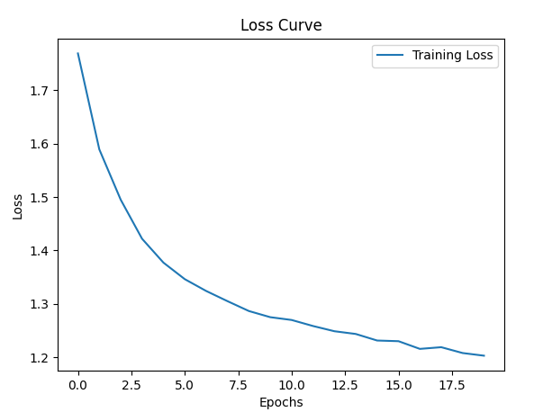
<br>
<br>

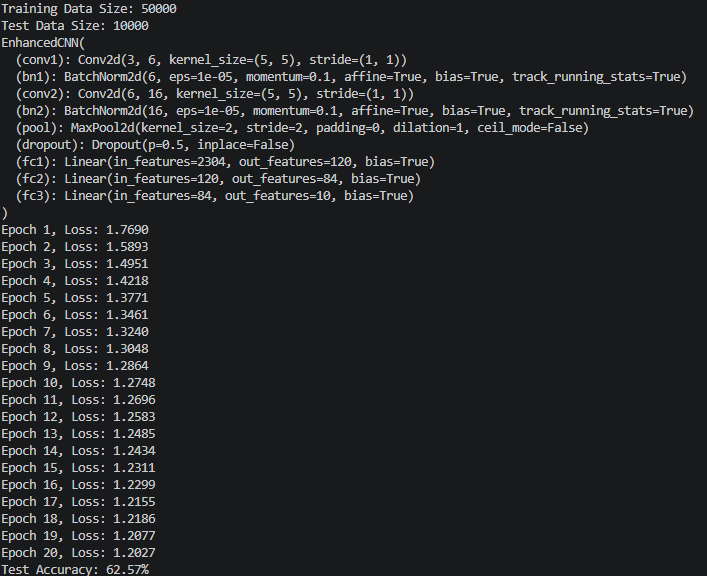
<br>
<br>

This week we gained hands-on experience building and optimizing CNNs from practical datasets. We understood the importance of regularization and augmentation in improving the model, generalization and developed skills in analyzing and tuning CNN performance, and prepare for real world scenarios requiring robust model training and evaluation based on the dataset that we have seen.

[⬆ Back to content](#content)